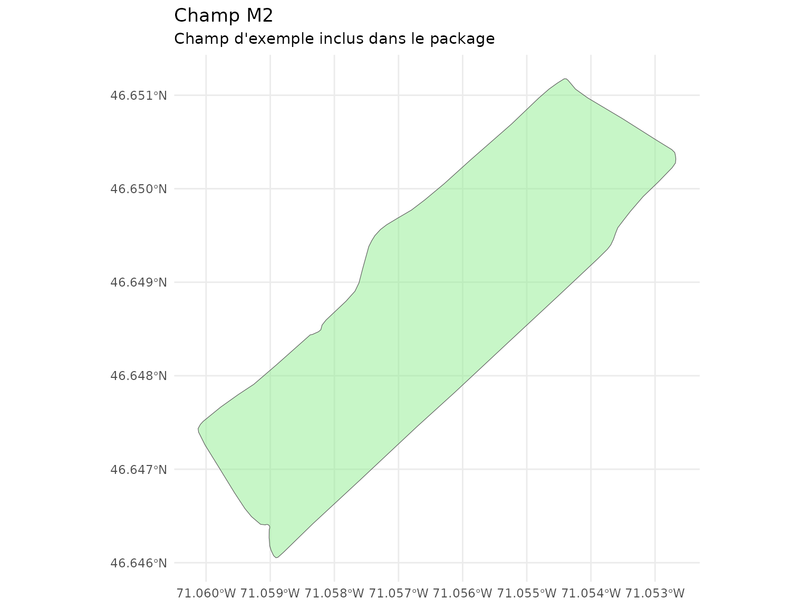

# Distances aux Arbres et Effet du Vent

``` r
library(covariablechamps)
library(sf)
library(terra)
library(ggplot2)
```

## Introduction

Ce guide présente les fonctions du package `covariablechamps` pour
calculer les distances aux arbres en tenant compte de la direction du
vent. Ces covariables sont essentielles pour modéliser la protection des
cultures contre le vent et l’ombrage.

Le package offre plusieurs approches:

- **Distance simple**: Distance euclidienne aux arbres les plus proches
- **Distances directionnelles (amont/aval)**: Distance distinguant le
  sens du vent
- **Fetch elliptique**: Distance avec effet de buffer elliptique aligné
  sur le vent

## Chargement du champ M2

Le package inclut un champ d’exemple (`M2`) situé au Québec.

``` r
champ <- st_read(system.file("extdata", "M2.shp", package = "covariablechamps"))
#> Reading layer `M2' from data source 
#>   `/home/runner/work/_temp/Library/covariablechamps/extdata/M2.shp' 
#>   using driver `ESRI Shapefile'
#> Simple feature collection with 1 feature and 65 fields
#> Geometry type: POLYGON
#> Dimension:     XY
#> Bounding box:  xmin: -71.06012 ymin: 46.64605 xmax: -71.05268 ymax: 46.65118
#> Geodetic CRS:  WGS 84

ggplot() +
  geom_sf(data = champ, fill = "lightgreen", alpha = 0.5) +
  theme_minimal() +
  labs(title = "Champ M2",
       subtitle = "Champ d'exemple inclus dans le package")
```



## Détection des arbres depuis LiDAR

Les arbres doivent être détectés à partir des données LiDAR. Utilisez
[`extraire_classifier_haies_lidar()`](https://cedricbouffard.github.io/covariablechamps/reference/extraire_classifier_haies_lidar.md)
pour obtenir les arbres classifiés.

**Note**: Cette opération nécessite des données LiDAR réelles.

``` r
# 1. Télécharger les données LiDAR
lidar <- telecharger_lidar_ponctuel(champ)

# 2. Détecter et classifier les arbres
resultat <- extraire_classifier_haies_lidar(
  nuage_points = lidar$nuage_points,
  res_dtm = 1,
  res_chm = 0.25,
  hmin = 2,
  eps_dbscan = 6,
  minPts_dbscan = 3
)

# 3. Récupérer les arbres
arbres <- resultat$trees_sf

# 4. Visualiser
plot(st_geometry(champ), col = "lightgreen")
plot(st_geometry(arbres), add = TRUE, col = "darkgreen", pch = 19, cex = 0.5)
```

## Distance simple aux arbres

La fonction
[`calculer_distance_arbres()`](https://cedricbouffard.github.io/covariablechamps/reference/calculer_distance_arbres.md)
calcule la distance euclidienne aux arbres.

``` r
dist_simple <- calculer_distance_arbres(
  arbres_sf = arbres,
  champ_bbox = champ,
  resolution = 2,
  buffer_arbre = 3,
  max_distance = 100
)

visualiser_distance_arbres(dist_simple, type = "buffer")
```

## Distances amont/aval avec direction du vent

La fonction
[`calculer_distances_amont_aval()`](https://cedricbouffard.github.io/covariablechamps/reference/calculer_distances_amont_aval.md)
distingue les distances selon la direction du vent:

- **Amont**: Vent qui vient DE l’arbre (protection contre le vent)
- **Aval**: Vent qui va VERS l’arbre (accélération après l’arbre)

``` r
dist_dir <- calculer_distances_amont_aval(
  arbres_sf = arbres,
  angle_vent = 270,
  champ_bbox = champ,
  resolution = 2,
  buffer_arbre = 3,
  angle_focal = 45,
  max_distance = 100,
  taille_lissage = 5
)

viz <- visualiser_distances_vent(dist_dir, type = "comparaison")
viz$amont
viz$aval
```

## Fetch de vent elliptique

La fonction
[`calculer_fetch_vent()`](https://cedricbouffard.github.io/covariablechamps/reference/calculer_fetch_vent.md)
calcule un buffer elliptique aligné avec la direction du vent.

``` r
fetch <- calculer_fetch_vent(
  arbres_sf = arbres,
  angle_vent = 270,
  champ_bbox = champ,
  resolution = 2,
  max_fetch = 100,
  coef_ellipse = 3
)

viz_fetch <- visualiser_fetch(fetch, type = "comparaison")
viz_fetch$simple
viz_fetch$elliptique
```

## Choisir la bonne approche

| Fonction                                                                                                                          | Usage                                        | Avantage                      |
|-----------------------------------------------------------------------------------------------------------------------------------|----------------------------------------------|-------------------------------|
| [`calculer_distance_arbres()`](https://cedricbouffard.github.io/covariablechamps/reference/calculer_distance_arbres.md)           | Distance simple sans direction               | Rapide, bon pour ombrage      |
| [`calculer_distances_amont_aval()`](https://cedricbouffard.github.io/covariablechamps/reference/calculer_distances_amont_aval.md) | Distances avec effet tampon et lissage       | Plus précis pour vent         |
| [`calculer_fetch_vent()`](https://cedricbouffard.github.io/covariablechamps/reference/calculer_fetch_vent.md)                     | Buffer elliptique pour effet directionnel    | Modélisation physically-based |
| [`calculer_distances_vent()`](https://cedricbouffard.github.io/covariablechamps/reference/calculer_distances_vent.md)             | Version simple des distances directionnelles | Bon compromis                 |

## Workflow complet

``` r
# 1. Charger le champ M2
champ <- st_read(system.file("extdata", "M2.shp", package = "covariablechamps"))

# 2. Télécharger et détecter les arbres
lidar <- telecharger_lidar_ponctuel(champ)
resultat <- extraire_classifier_haies_lidar(nuage_points = lidar$nuage_points)
arbres <- resultat$trees_sf

# 3. Distance simple
dist_simple <- calculer_distance_arbres(
  arbres_sf = arbres,
  champ_bbox = champ,
  buffer_arbre = 3
)
visualiser_distance_arbres(dist_simple, type = "buffer")

# 4. Distances amont/aval
dist_dir <- calculer_distances_amont_aval(
  arbres_sf = arbres,
  angle_vent = 270,
  champ_bbox = champ,
  buffer_arbre = 3
)
visualiser_distances_vent(dist_dir, type = "comparaison")

# 5. Simuler la vitesse
vitesse <- simuler_vitesse_vent(
  result = dist_dir,
  vitesse_ref = 5,
  coef_amont = 0.5,
  coef_aval = 0.3
)

# 6. Cartographier
tracer_carte_vent(distances, type = "les_deux")
```
