# Distances aux Arbres et Effet du Vent

``` r
library(covariablechamps)
library(sf)
library(terra)
library(ggplot2)
```

## Introduction

Ce guide présente les fonctions du package `covariablechamps` pour
calculer les distances aux arbres en tenant compte de la direction du
vent. Ces covariables sont essentielles pour modéliser la protection des
cultures contre le vent et l’ombrage.

Le package offre plusieurs approches:

- **Distance simple**: Distance euclidienne aux arbres les plus proches
- **Distances directionnelles (amont/aval)**: Distance distinguant le
  sens du vent
- **Fetch elliptique**: Distance avec effet de buffer elliptique aligné
  sur le vent

## Création des données d’exemple

Pour cet article, nous créons des données synthétiques représentant un
champ avec des arbres.

``` r
# Créer un champ (polygone 200m x 150m)
coords_champ <- matrix(c(0, 0, 200, 0, 200, 150, 0, 150, 0, 0), ncol = 2, byrow = TRUE)
champ <- sf::st_polygon(list(coords_champ))
champ <- sf::st_sfc(champ, crs = 32618)
champ <- sf::st_sf(geometry = champ)

# Créer des arbres (points dispersés autour du champ)
set.seed(42)
coords_arbres <- rbind(
  # Arbres à l'ouest (x < 10)
  cbind(runif(5, -20, 5), runif(5, 20, 130)),
  # Arbres à l'est (x > 190)
  cbind(runif(5, 195, 220), runif(5, 20, 130)),
  # Arbres au nord (y > 140)
  cbind(runif(4, 20, 180), runif(4, 145, 170)),
  # Quelques arbres isolés
  c(50, 75), c(120, 60), c(150, 100)
)

# Créer les points individually
pts <- lapply(1:nrow(coords_arbres), function(i) {
  sf::st_point(coords_arbres[i, ])
})

arbres <- sf::st_sf(
  id = 1:nrow(coords_arbres),
  geometry = sf::st_sfc(pts, crs = 32618)
)

# Visualiser les données
ggplot() +
  geom_sf(data = champ, fill = "lightgreen", alpha = 0.3) +
  geom_sf(data = arbres, color = "darkgreen", size = 3) +
  ggtitle("Champ agricole avec arbres (points verts)") +
  theme_minimal()
```

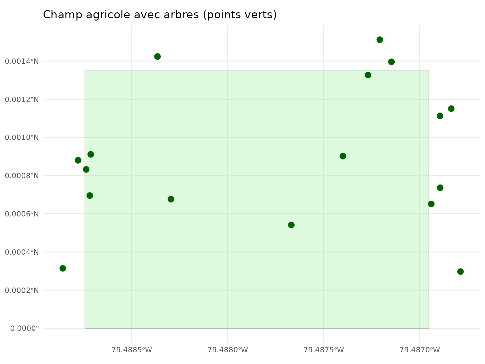

## Étape 1: Distance simple aux arbres

La fonction
[`calculer_distance_arbres()`](https://cedricbouffard.github.io/covariablechamps/reference/calculer_distance_arbres.md)
calcule la distance euclidienne aux arbres avec un buffer optionnel.

``` r
dist_simple <- calculer_distance_arbres(
  arbres_sf = arbres,
  champ_bbox = champ,
  resolution = 5,
  buffer_arbre = 3,
  max_distance = 100
)
#> Calcul distance aux arbres (buffer: 3m)...
#> Création du buffer...
#> Calcul des distances euclidiennes...
#> Lissage...
#> Terminé!

# Visualiser la distance au buffer des arbres
visualiser_distance_arbres(dist_simple, type = "buffer")
```


``` r
# Visualiser la distance aux points d'arbres
visualiser_distance_arbres(dist_simple, type = "points")
```


## Étape 2: Comparaison des méthodes de distance

``` r
# Comparaison buffer vs points
viz <- visualiser_distance_arbres(dist_simple, type = "comparaison")
viz$points
```

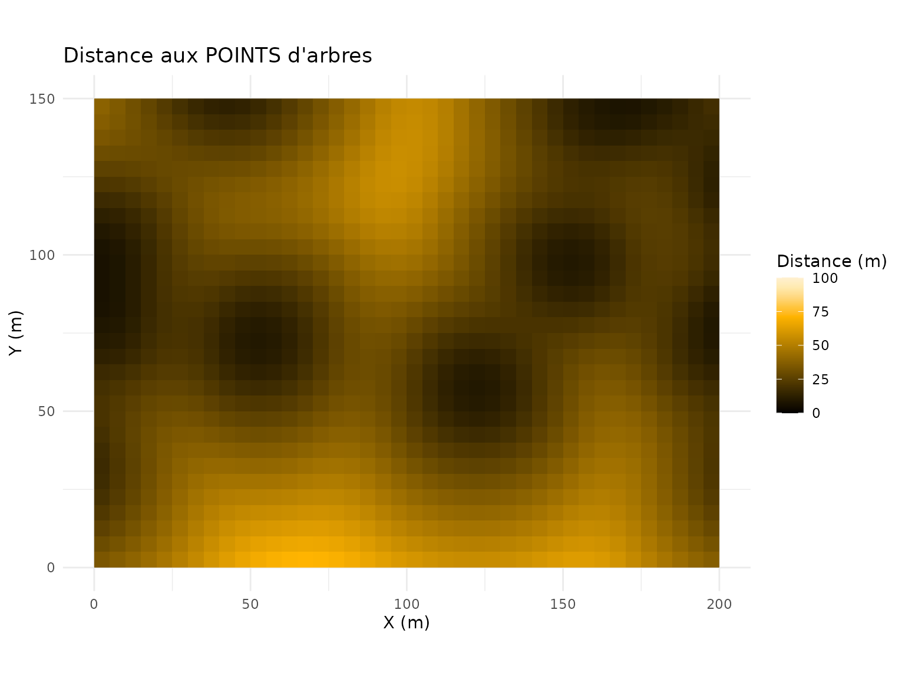

``` r
viz$buffer
```

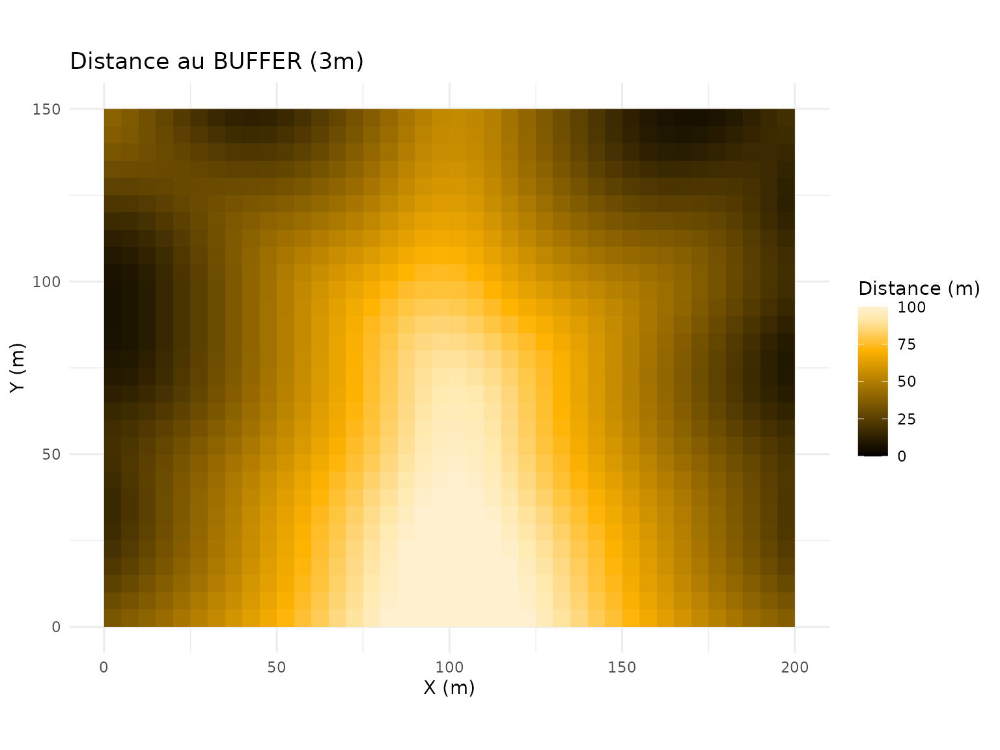

## Étape 3: Distances amont/aval avec direction du vent

La fonction
[`calculer_distances_amont_aval()`](https://cedricbouffard.github.io/covariablechamps/reference/calculer_distances_amont_aval.md)
distingue les distances selon la direction du vent:

- **Amont**: Vent qui vient DE l’arbre (protection contre le vent)
- **Aval**: Vent qui va VERS l’arbre (accélération après l’arbre)

``` r
# Calcul avec vent de 270 degrés (vent d'ouest)
dist_dir <- calculer_distances_amont_aval(
  arbres_sf = arbres,
  angle_vent = 270,
  champ_bbox = champ,
  resolution = 5,
  buffer_arbre = 3,
  angle_focal = 45,
  max_distance = 100,
  taille_lissage = 5
)
#> Calcul distances amont/aval (buffer: 3m, angle focal: 45°)...
#> Création du buffer dissous...
#> Buffer dissous créé
#> 17 arbres
#> Calcul des distances...
#> Lissage...
#> Terminé!

# Visualiser la comparaison amont vs aval
viz <- visualiser_distances_vent(dist_dir, type = "comparaison")
viz$amont
```


``` r
viz$aval
```


### Visualiser chaque type séparément

``` r
visualiser_distances_vent(dist_dir, type = "amont")
```

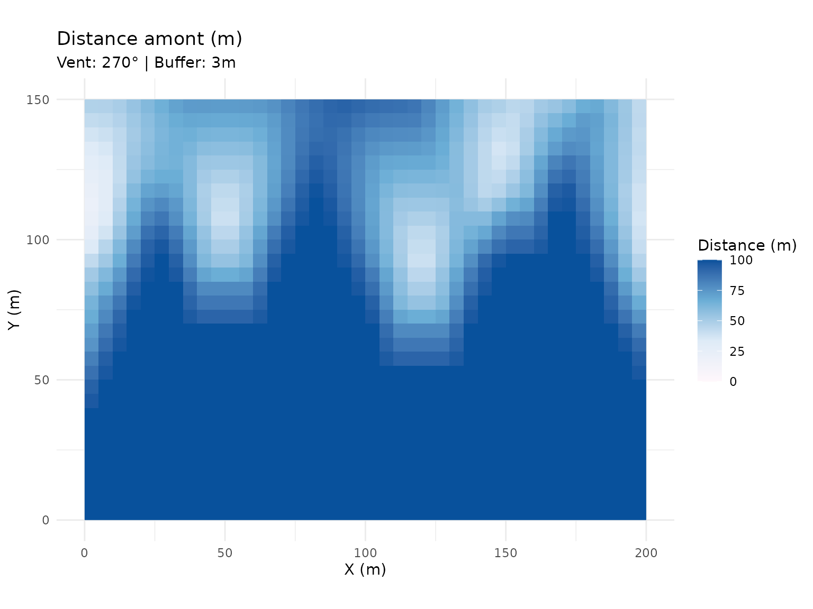

``` r
visualiser_distances_vent(dist_dir, type = "aval")
```

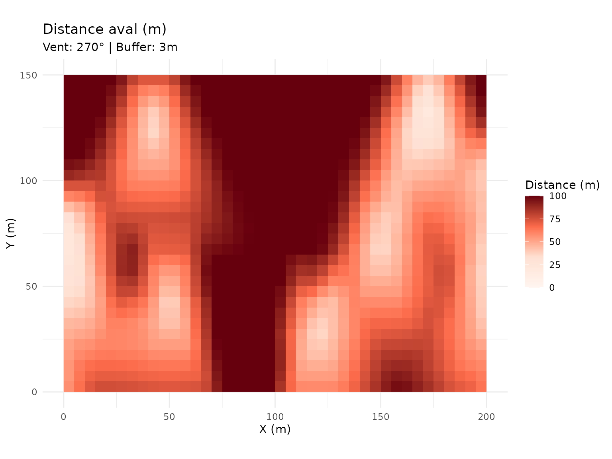

``` r
visualiser_distances_vent(dist_dir, type = "totale")
```

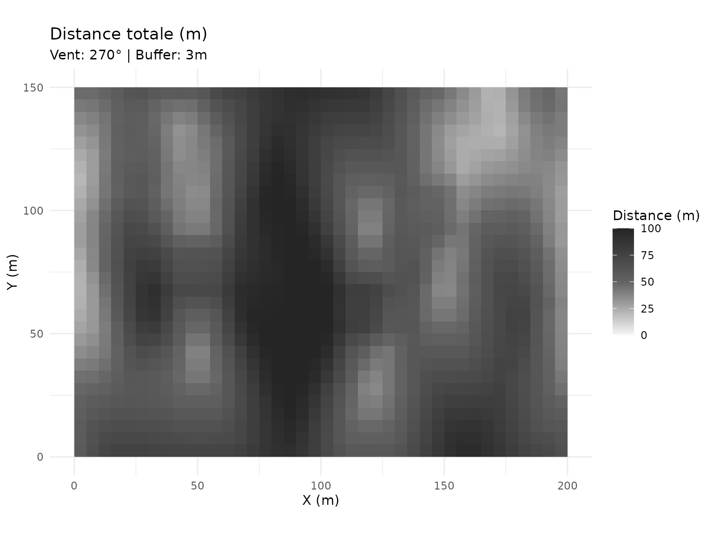

## Étape 4: Fetch de vent elliptique

La fonction
[`calculer_fetch_vent()`](https://cedricbouffard.github.io/covariablechamps/reference/calculer_fetch_vent.md)
calcule un buffer elliptique aligné avec la direction du vent. Le vent a
plus d’effet dans sa direction de propagation.

``` r
fetch <- calculer_fetch_vent(
  arbres_sf = arbres,
  angle_vent = 270,
  champ_bbox = champ,
  resolution = 5,
  max_fetch = 100,
  coef_ellipse = 3
)
#> Calcul du fetch de vent (elliptique)...
#> Création du buffer autour des arbres...
#> Rasterisation...
#> Calcul des distances...
#> Calcul directionnel...
#> Terminé!

viz_fetch <- visualiser_fetch(fetch, type = "comparaison")
viz_fetch$simple
```


``` r
viz_fetch$elliptique
```


### Fetch elliptique seul

``` r
visualiser_fetch(fetch, type = "elliptique")
```

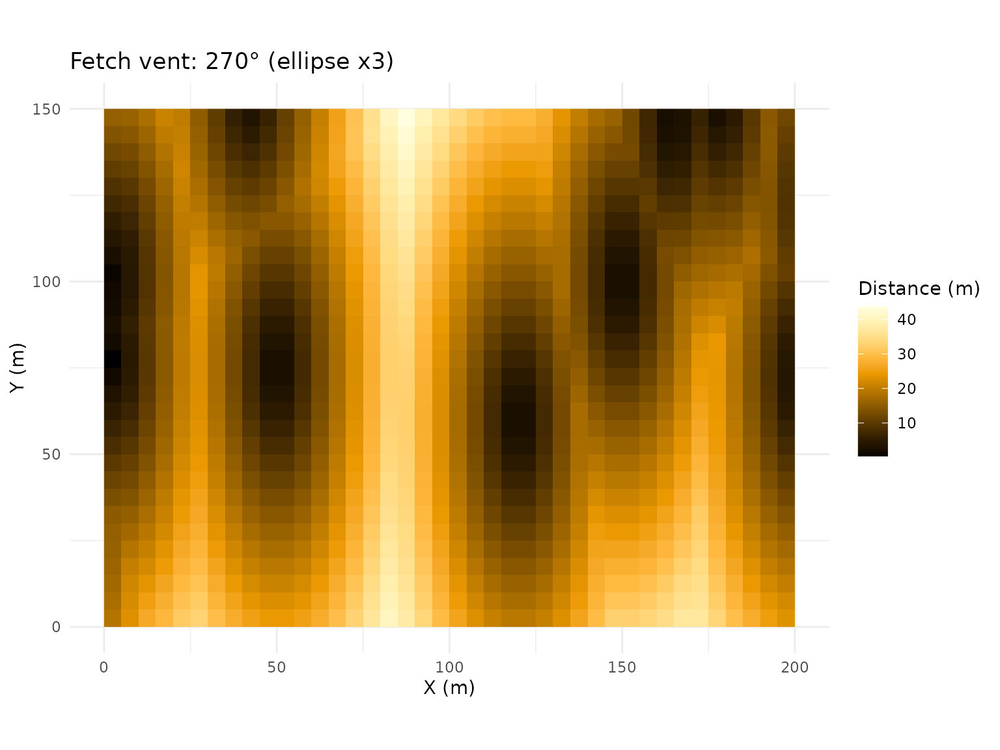

## Étape 5: Simuler la vitesse du vent

Plusieurs fonctions permettent de simuler la vitesse du vent selon les
distances calculées:

### Simulation simple (distance euclidienne)

``` r
vitesse_simple <- simuler_vitesse_vent_simple(
  dist_result = dist_simple,
  vitesse_ref = 5,
  coef_protection = 0.5
)

# Visualiser directement avec terra
plot(vitesse_simple$vitesse, main = "Vitesse du vent (m/s)",
     col = hcl.colors(100, "RdBu"))
```

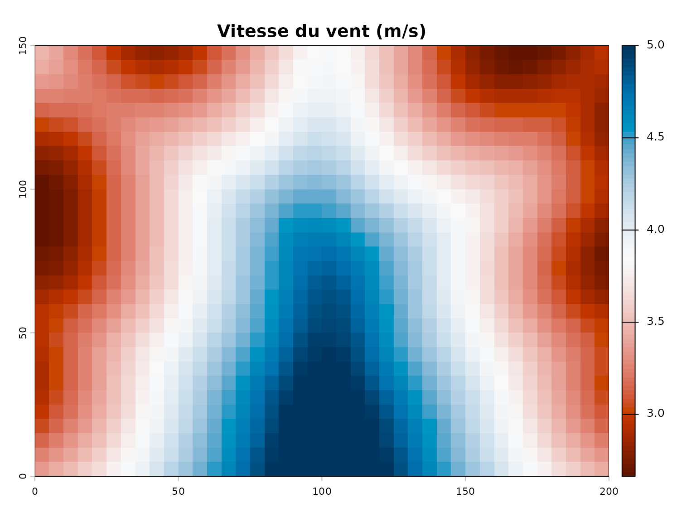

### Simulation avec distances amont/aval

Pour le résultat de `calculer_distances_amont_aval`, la simulation
directe n’est pas disponible. À la place, vous pouvez utiliser le
résultat pour analyses ultérieures ou créer une carte de vent :

``` r
# Le résultat dist_dir contient les rasters amont, aval et totale
# Ces rasters peuvent être utilisés directement pour l'analyse
par(mfrow = c(1, 3), mar = c(3, 3, 3, 3))
plot(dist_dir$amont, main = "Distance amont (m)")
plot(dist_dir$aval, main = "Distance aval (m)")
plot(dist_dir$totale, main = "Distance totale (m)")
```

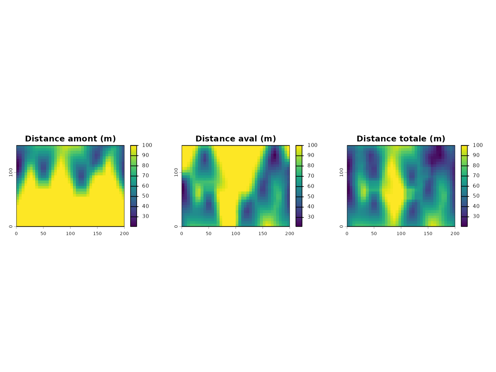

## Étape 6: Cartographie avec flèches de vent

La fonction
[`tracer_carte_vent()`](https://cedricbouffard.github.io/covariablechamps/reference/tracer_carte_vent.md)
crée une carte avec les distances et des flèches indiquant la direction
du vent.

``` r
distances <- calculer_distances_vent(
  arbres_sf = arbres,
  angle_vent = 270,
  champ_bbox = champ,
  resolution = 5,
  max_distance = 100,
  ouverture_angulaire = 45
)
#> CRS arbres: EPSG:32618
#> CRS champ: EPSG:32618
#> Utilisation du CRS des arbres comme référence
#> Bounding box: [0.0, 200.0] x [0.0, 150.0]
#> Création du raster...
#> Raster créé: 80x70 cellules
#> Rasterisation des arbres...
#> Arbres rasterisés: 17
#> Calcul des distances...
#> Calcul des directions...
#> Traitement de 5600 cellules...
#> Crop final...
#> Terminé!

carte_amont <- tracer_carte_vent(distances, type = "amont")
carte_amont
#> Warning: Raster pixels are placed at uneven horizontal intervals and will be shifted
#> ℹ Consider using `geom_tile()` instead.
#> Raster pixels are placed at uneven horizontal intervals and will be shifted
#> ℹ Consider using `geom_tile()` instead.
```

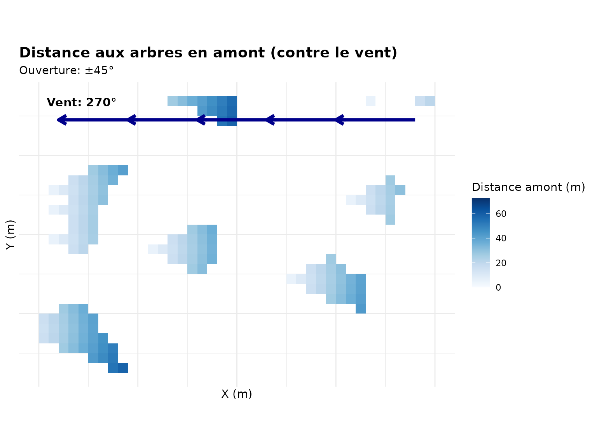

``` r
carte_aval <- tracer_carte_vent(distances, type = "aval")
carte_aval
#> Warning: Raster pixels are placed at uneven horizontal intervals and will be shifted
#> ℹ Consider using `geom_tile()` instead.
```

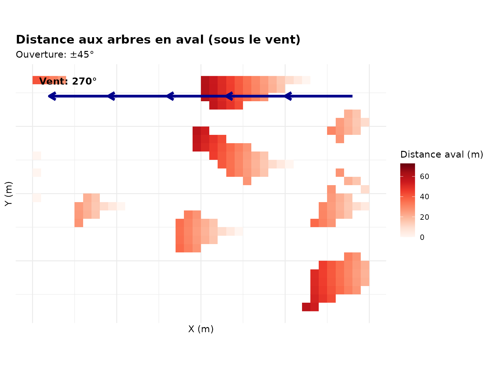

``` r
carte_combinee <- tracer_carte_vent(distances, type = "les_deux")
carte_combinee
```

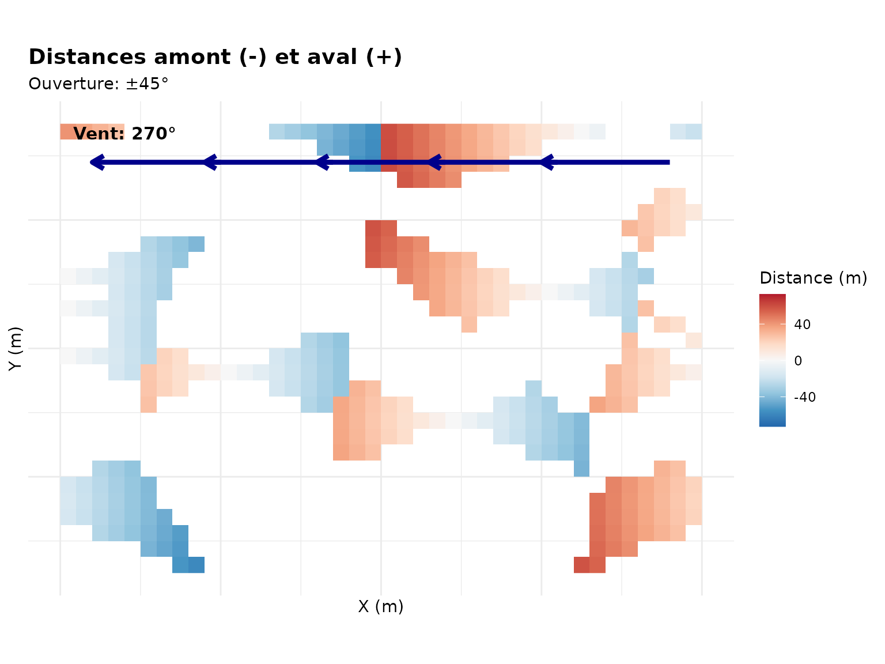

## Comparaison des méthodes

### Différence entre distance simple et directionnelle

``` r
# Préparer les données pour comparaison
df_simple <- as.data.frame(dist_simple$distance_buffer, xy = TRUE)
names(df_simple)[3] <- "distance"

df_dir <- as.data.frame(dist_dir$totale, xy = TRUE)
names(df_dir)[3] <- "distance"

# Créer une comparaison visuelle
par(mfrow = c(1, 2), mar = c(4, 4, 2, 2))
plot(dist_simple$distance_buffer, main = "Distance simple (buffer)")
plot(dist_dir$totale, main = "Distance directionnelle (totale)")
```

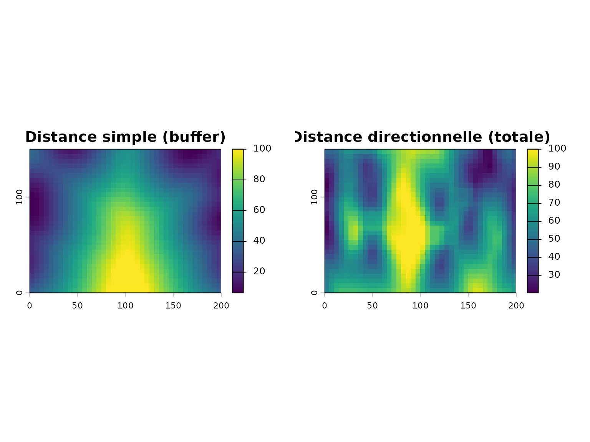

## Choisir la bonne approche

| Fonction                                                                                                                          | Usage                                        | Avantage                      |
|-----------------------------------------------------------------------------------------------------------------------------------|----------------------------------------------|-------------------------------|
| [`calculer_distance_arbres()`](https://cedricbouffard.github.io/covariablechamps/reference/calculer_distance_arbres.md)           | Distance simple sans direction               | Rapide, bon pour ombrage      |
| [`calculer_distances_amont_aval()`](https://cedricbouffard.github.io/covariablechamps/reference/calculer_distances_amont_aval.md) | Distances avec effet tampon et lissage       | Plus précis pour vent         |
| [`calculer_fetch_vent()`](https://cedricbouffard.github.io/covariablechamps/reference/calculer_fetch_vent.md)                     | Buffer elliptique pour effet directionnel    | Modélisation physically-based |
| [`calculer_distances_vent()`](https://cedricbouffard.github.io/covariablechamps/reference/calculer_distances_vent.md)             | Version simple des distances directionnelles | Bon compromis                 |

## Workflow complet

Voici un exemple de workflow complet pour analyser l’effet du vent:

``` r
# 1. Charger les données (remplacez par vos fichiers)
champ <- st_read("chemin/vers/champ.shp")
arbres <- st_read("chemin/vers/arbres.shp")

# 2. Distance simple
dist_simple <- calculer_distance_arbres(
  arbres_sf = arbres,
  champ_bbox = champ,
  buffer_arbre = 3
)
visualiser_distance_arbres(dist_simple, type = "buffer")

# 3. Distances amont/aval
dist_dir <- calculer_distances_amont_aval(
  arbres_sf = arbres,
  angle_vent = 270,  # Vent d'ouest
  champ_bbox = champ,
  buffer_arbre = 3
)
visualiser_distances_vent(dist_dir, type = "comparaison")

# 4. Simuler la vitesse
vitesse <- simuler_vitesse_vent(
  result = dist_dir,
  vitesse_ref = 5,
  coef_amont = 0.5,
  coef_aval = 0.3
)

# 5. Cartographier
tracer_carte_vent(distances, type = "les_deux")
```
