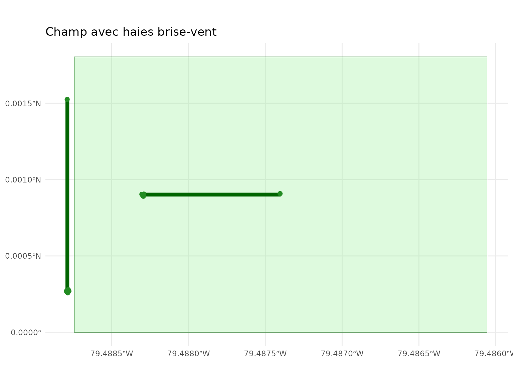
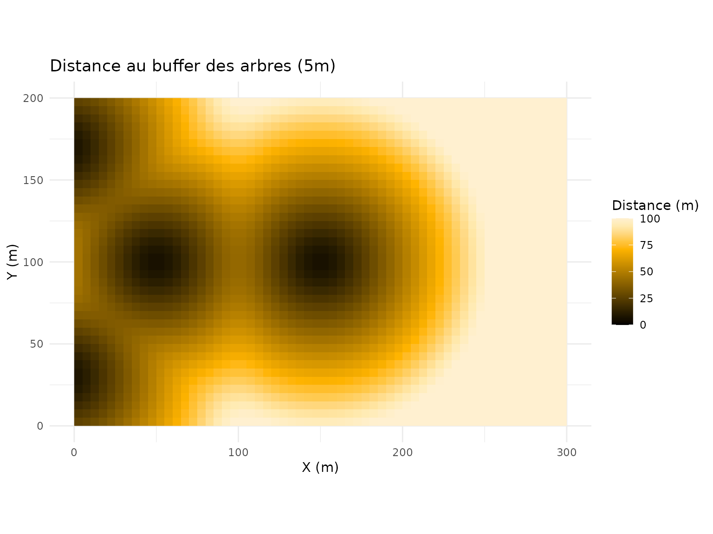
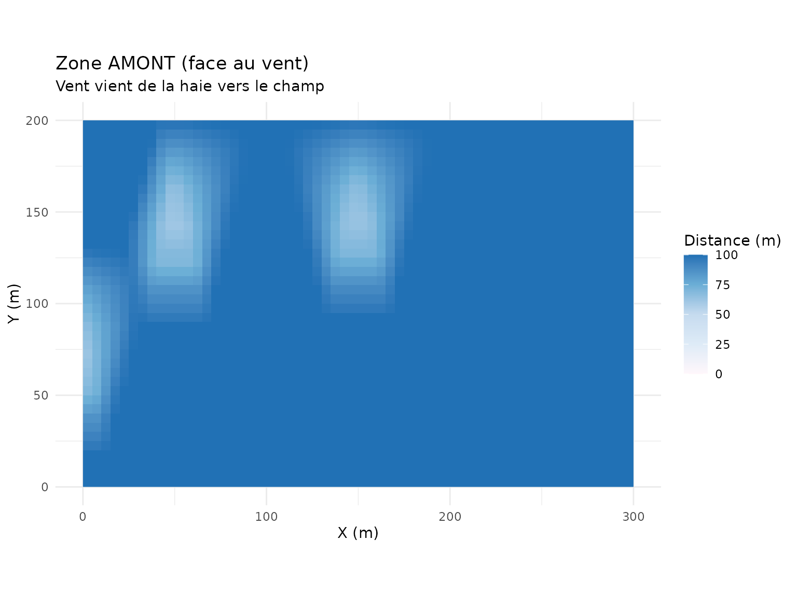
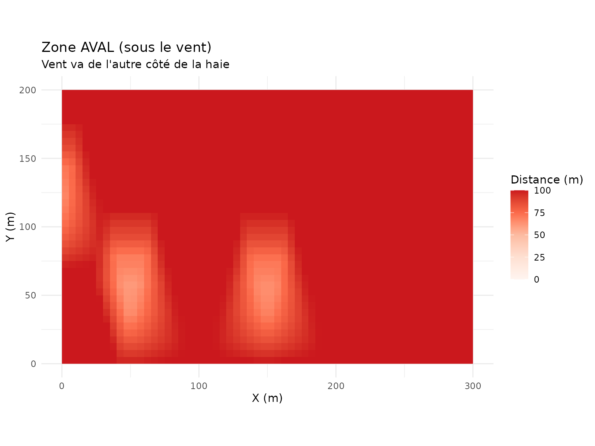
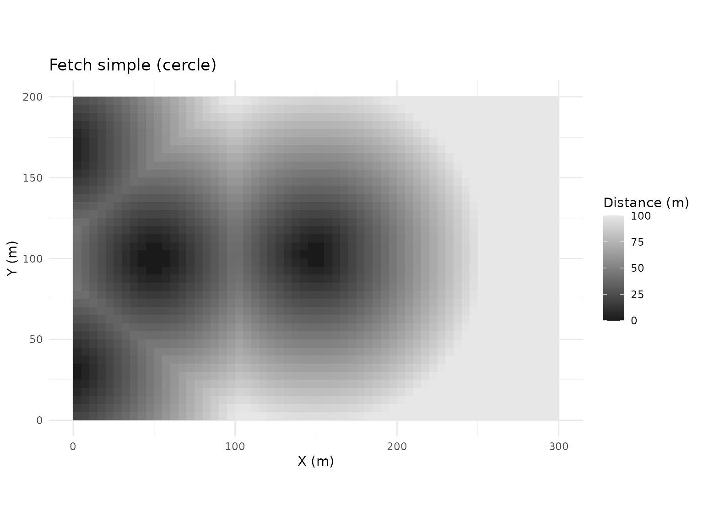
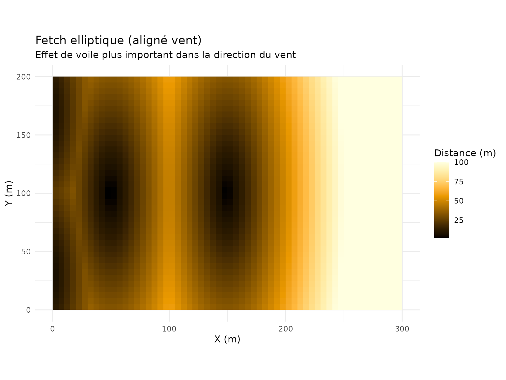
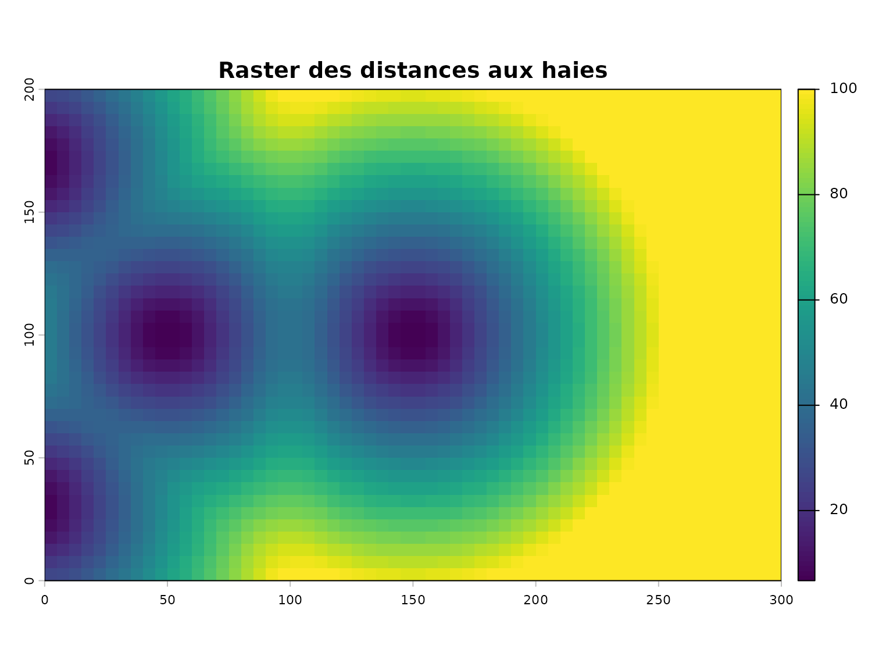
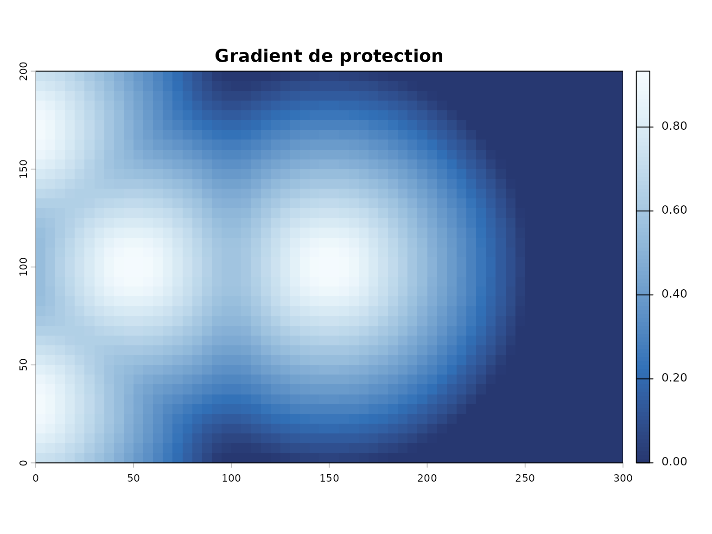
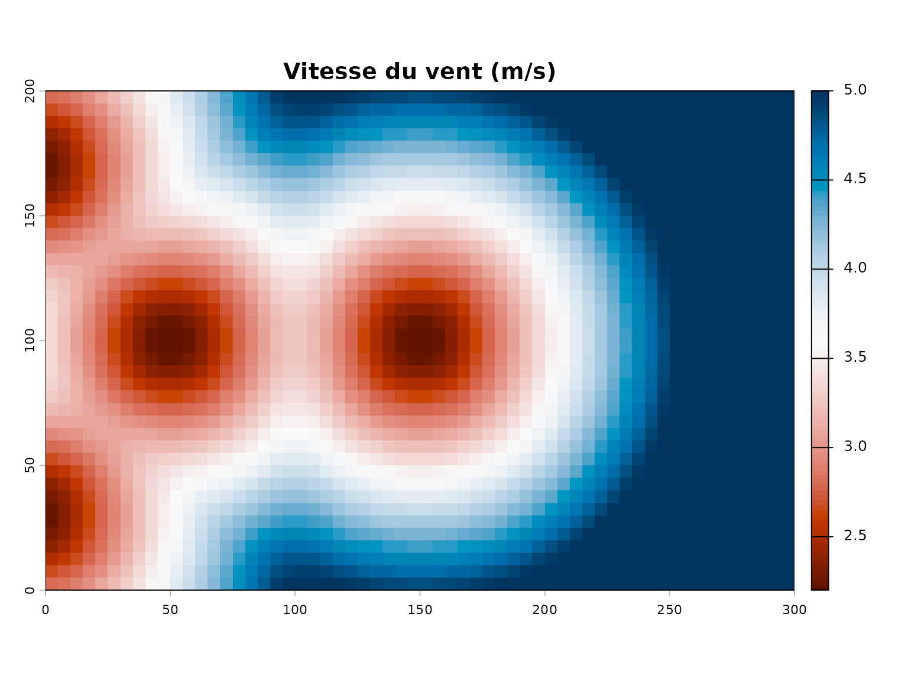
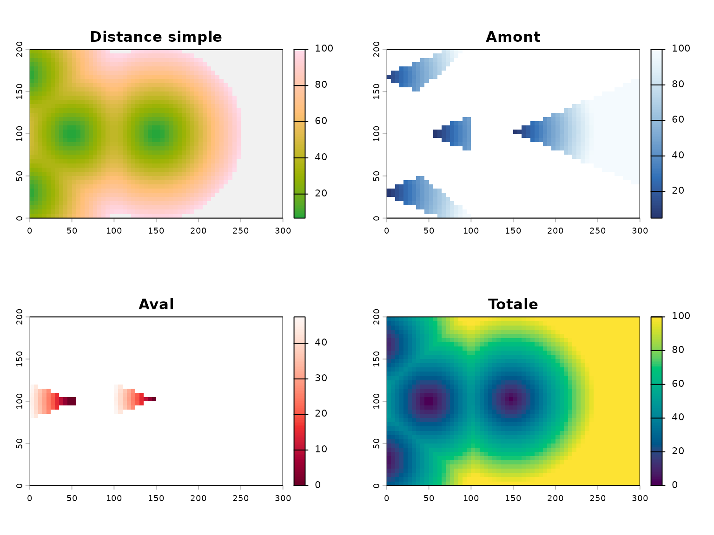

# Detection et analyse des haies brise-vent

``` r
library(covariablechamps)
library(sf)
library(terra)
library(ggplot2)
```

## Introduction

Les haies brise-vent jouent un rôle important dans la protection des
cultures contre le vent. Ce guide présente les fonctions du package
`covariablechamps` pour détecter, classifier et analyser les haies à
partir des données LiDAR.

## Données d’exemple

Pour cet article, nous créons des données synthétiques représentant un
champ avec des haies.

``` r
# Créer un champ
coords_champ <- matrix(c(0, 0, 300, 0, 300, 200, 0, 200, 0, 0), ncol = 2, byrow = TRUE)
champ <- sf::st_polygon(list(coords_champ))
champ <- sf::st_sfc(champ, crs = 32618)
champ <- sf::st_sf(geometry = champ)

# Créer des haies comme lignes droites
haie_ouest <- sf::st_sfc(
  sf::st_linestring(matrix(c(-5, 30, -5, 170), ncol = 2, byrow = TRUE)),
  crs = 32618
)
haie_interieure <- sf::st_sfc(
  sf::st_linestring(matrix(c(50, 100, 150, 100), ncol = 2, byrow = TRUE)),
  crs = 32618
)

# Créer un sf avec deux géométries
haies <- sf::st_sf(
  id = 1:2,
  geometry = c(haie_ouest, haie_interieure)
)

# Convertir les haies en POINTS pour les fonctions de distance
set.seed(42)
points_haie <- lapply(1:2, function(i) {
  g <- haies$geometry[[i]]
  coords <- sf::st_coordinates(g)
  n <- max(3, floor(sf::st_length(g) / 10))
  if (n > 1) {
    seq_idx <- seq(1, nrow(coords), length.out = n)
  } else {
    seq_idx <- 1
  }
  pts <- coords[seq_idx, , drop = FALSE]
  data.frame(
    id = rep(i, nrow(pts)),
    x = pts[, 1] + rnorm(nrow(pts), 0, 0.5),
    y = pts[, 2] + rnorm(nrow(pts), 0, 0.5)
  )
})
points_haie <- do.call(rbind, points_haie)

arbres_haies <- sf::st_sf(
  id = points_haie$id,
  geometry = sf::st_sfc(
    lapply(1:nrow(points_haie), function(i) {
      sf::st_point(c(points_haie$x[i], points_haie$y[i]))
    }),
    crs = 32618
  )
)

ggplot() +
  geom_sf(data = champ, fill = "lightgreen", alpha = 0.3, col = "darkgreen") +
  geom_sf(data = haies, col = "darkgreen", lwd = 2) +
  geom_sf(data = arbres_haies, col = "forestgreen", size = 2) +
  ggtitle("Champ avec haies brise-vent") +
  theme_minimal()
```



## Étape 1: Calculer les zones de protection

Les haies brise-vent créent des zones de protection dont l’étendue
dépend de la hauteur de la haie.

``` r
# Direction du vent dominante (en degrés)
direction_vent <- 270  # Vent d'ouest

# Créer un raster de zones de vent à partir des distances
distances_haies <- calculer_distance_arbres(
  arbres_sf = arbres_haies,
  champ_bbox = champ,
  resolution = 5,
  buffer_arbre = 5,
  max_distance = 100
)

# Visualiser les zones de protection
visualiser_distance_arbres(distances_haies, type = "buffer")
```



### Comprendre les zones de protection

La protection offerte par une haie diminue avec la distance:

- **Zone 1-2H**: Protection maximale (réduction du vent \> 50%)
- **Zone 2-5H**: Protection modérée (réduction 20-50%)
- **Zone 5-10H**: Protection faible (réduction \< 20%)

où H est la hauteur de la haie.

## Étape 2: Distance directionnelle (amont/aval)

``` r
dist_dir_haies <- calculer_distances_amont_aval(
  arbres_sf = arbres_haies,
  angle_vent = direction_vent,
  champ_bbox = champ,
  resolution = 5,
  buffer_arbre = 5,
  angle_focal = 30,
  max_distance = 100
)

viz <- visualiser_distances_vent(dist_dir_haies, type = "comparaison")
viz$amont +
  ggtitle("Zone AMONT (face au vent)",
          subtitle = "Vent vient de la haie vers le champ") +
  theme_minimal()
```



``` r

viz$aval +
  ggtitle("Zone AVAL (sous le vent)",
          subtitle = "Vent va de l'autre côté de la haie") +
  theme_minimal()
```



## Étape 3: Fetch de vent

``` r
fetch_haies <- calculer_fetch_vent(
  arbres_sf = arbres_haies,
  angle_vent = direction_vent,
  champ_bbox = champ,
  resolution = 5,
  max_fetch = 100,
  coef_ellipse = 3
)

viz_fetch <- visualiser_fetch(fetch_haies, type = "comparaison")
viz_fetch$simple +
  ggtitle("Fetch simple (cercle)") +
  theme_minimal()
```



``` r

viz_fetch$elliptique +
  ggtitle("Fetch elliptique (aligné vent)",
          subtitle = "Effet de voile plus important dans la direction du vent") +
  theme_minimal()
```



## Étape 4: Rasterisation pour analyse

Pour des analyses spatiales plus poussées, les zones peuvent être
rasterisées.

``` r
# La rasterisation utilise le résultat des distances
raster_dist <- distances_haies$distance_buffer
plot(raster_dist, main = "Raster des distances aux haies")
```



### Gradient continu

Le gradient montre la diminution progressive de la protection:

``` r
# Créer un gradient de protection (1 = protection max, 0 = pas de protection)
raster_protection <- distances_haies$distance_buffer / distances_haies$max_distance
raster_protection <- 1 - raster_protection

# Visualiser
plot(raster_protection, main = "Gradient de protection",
     col = hcl.colors(100, "Blues"))
```



## Étape 5: Simulation de la vitesse du vent

Estimez la réduction de vitesse du vent due aux haies.

``` r
# Avec les distances simples
vitesse_simple <- simuler_vitesse_vent_simple(
  dist_result = distances_haies,
  vitesse_ref = 5,
  coef_protection = 0.6
)

# Visualiser directement avec terra
print(terra::plot(vitesse_simple$vitesse, main = "Vitesse du vent (m/s)",
     col = hcl.colors(100, "RdBu")))
#> $ext
#> xmin xmax ymin ymax 
#>    0  300    0  200 
#> 
#> $lim
#> xmin xmax ymin ymax 
#>    0  300    0  200 
#> 
#> $add
#> [1] FALSE
#> 
#> $axs
#> $axs$las
#> [1] 0
#> 
#> $axs$cex.lab
#> [1] 0.8
#> 
#> $axs$line.lab
#> [1] 1.5
#> 
#> $axs$cex.axis
#> [1] 0.7
#> 
#> $axs$mgp
#> [1] 2.00 0.25 0.30
#> 
#> $axs$tcl
#> [1] -0.25
#> 
#> $axs$side
#> [1] 1 2
#> 
#> $axs$tick
#> [1] 1 2
#> 
#> $axs$lab
#> [1] 1 2
#> 
#> 
#> $draw_grid
#> [1] FALSE
#> 
#> $leg
#> $leg$sort
#> [1] FALSE
#> 
#> $leg$reverse
#> [1] FALSE
#> 
#> $leg$digits
#> [1] 1
#> 
#> $leg$x
#> [1] "right"
#> 
#> $leg$horiz
#> [1] FALSE
#> 
#> $leg$ext
#>       xmin     xmax ymin ymax       dx  dy
#> 1 306.8182 313.6364    0  200 6.818182 200
#> 
#> $leg$user
#> [1] FALSE
#> 
#> $leg$size
#> [1] 1 1
#> 
#> 
#> $all_levels
#> [1] FALSE
#> 
#> $lonlat
#> [1] FALSE
#> 
#> $asp
#> [1] 1
#> 
#> $cols
#>   [1] "#611300" "#691600" "#701800" "#771A00" "#7E1D00" "#861F00" "#8D2200"
#>   [8] "#952400" "#9C2700" "#A42900" "#AB2C00" "#B32F00" "#BA3100" "#C13500"
#>  [15] "#C43D00" "#C74403" "#CA4B1D" "#CD522C" "#D05838" "#D35F42" "#D5654C"
#>  [22] "#D76B54" "#DA715C" "#DC7864" "#DE7E6C" "#E08373" "#E1897A" "#E38F81"
#>  [29] "#E59588" "#E69A8F" "#E7A095" "#E9A69C" "#EAABA2" "#EBB0A8" "#ECB6AE"
#>  [36] "#EDBBB4" "#EEC0BA" "#EFC5C0" "#F0CAC6" "#F1CFCB" "#F1D4D1" "#F2D9D6"
#>  [43] "#F3DDDB" "#F4E2E0" "#F4E6E5" "#F5EAE9" "#F6EEED" "#F7F2F1" "#F8F5F5"
#>  [50] "#F9F8F8" "#F9F9F9" "#F7F8F9" "#F5F7F8" "#F3F5F7" "#EFF3F6" "#ECF1F5"
#>  [57] "#E8EFF4" "#E4ECF3" "#E0EAF1" "#DBE7F0" "#D6E4EE" "#D1E1ED" "#CBDEEB"
#>  [64] "#C6DBE9" "#C0D7E8" "#B9D4E6" "#B3D0E4" "#ACCDE2" "#A5C9E0" "#9DC5DD"
#>  [71] "#96C1DB" "#8DBDD9" "#85B9D7" "#7CB5D4" "#72B1D2" "#67ACD0" "#5CA8CD"
#>  [78] "#4FA4CB" "#3F9FC8" "#299BC6" "#0096C3" "#0092C1" "#008DBE" "#0089BB"
#>  [85] "#0085B9" "#0080B7" "#007CB4" "#0077B2" "#0073B0" "#006EAA" "#0068A2"
#>  [92] "#00629A" "#005C92" "#00568A" "#005082" "#004A7A" "#004573" "#003F6C"
#>  [99] "#003A66" "#003560"
#> 
#> $rgb
#> $rgb$scale
#> [1] 255
#> 
#> $rgb$zcol
#> [1] FALSE
#> 
#> $rgb$colNA
#> [1] "white"
#> 
#> 
#> $alpha
#> [1] 255
#> 
#> $clip
#> [1] TRUE
#> 
#> $dots
#> list()
#> 
#> $reset
#> [1] FALSE
#> 
#> $main
#> [1] "Vitesse du vent (m/s)"
#> 
#> $halo.main
#> [1] FALSE
#> 
#> $halo.main.hc
#> [1] "white"
#> 
#> $halo.main.hw
#> [1] 0.1
#> 
#> $cex.main
#> [1] 1.2
#> 
#> $font.main
#> [1] 2
#> 
#> $col.main
#> [1] "black"
#> 
#> $line.main
#> [1] 0.5
#> 
#> $sub
#> [1] ""
#> 
#> $cex.sub
#> [1] 0.96
#> 
#> $font.sub
#> [1] 1
#> 
#> $col.sub
#> [1] "black"
#> 
#> $line.sub
#> [1] 1.75
#> 
#> $axes
#> [1] TRUE
#> 
#> $xaxs
#> [1] "i"
#> 
#> $yaxs
#> [1] "i"
#> 
#> $xlab
#> [1] ""
#> 
#> $ylab
#> [1] ""
#> 
#> $breakby
#> [1] "eqint"
#> 
#> $interpolate
#> [1] FALSE
#> 
#> $legend_draw
#> [1] TRUE
#> 
#> $legend_only
#> [1] FALSE
#> 
#> $box
#> [1] TRUE
#> 
#> $zebra
#> [1] FALSE
#> 
#> $zebra.cex
#> [1] 1
#> 
#> $zebra.col
#> [1] "black" "white"
#> 
#> $values
#> [1] TRUE
#> 
#> $fill_range
#> [1] FALSE
#> 
#> $range
#> [1] 2.200577 5.000000
#> 
#> $r
#>       [,1]      [,2]      [,3]      [,4]      [,5]      [,6]      [,7]     
#>  [1,] "#D76B54" "#DA715C" "#DE7E6C" "#E38F81" "#E9A69C" "#EDBBB4" "#F1CFCB"
#>  [2,] "#CA4B1D" "#D05838" "#D5654C" "#DE7E6C" "#E38F81" "#EAABA2" "#EEC0BA"
#>  [3,] "#B32F00" "#C13500" "#CA4B1D" "#D5654C" "#DE7E6C" "#E69A8F" "#ECB6AE"
#>  [4,] "#8D2200" "#A42900" "#C13500" "#D05838" "#DA715C" "#E38F81" "#EAABA2"
#>  [5,] "#771A00" "#8D2200" "#B32F00" "#CA4B1D" "#D76B54" "#E1897A" "#E9A69C"
#>  [6,] "#691600" "#861F00" "#AB2C00" "#C74403" "#D5654C" "#E08373" "#E7A095"
#>  [7,] "#691600" "#861F00" "#AB2C00" "#C74403" "#D5654C" "#E08373" "#E7A095"
#>  [8,] "#771A00" "#8D2200" "#B32F00" "#CA4B1D" "#D76B54" "#E1897A" "#E9A69C"
#>  [9,] "#8D2200" "#A42900" "#C13500" "#D05838" "#DA715C" "#E38F81" "#EAABA2"
#> [10,] "#B32F00" "#C13500" "#CA4B1D" "#D5654C" "#DE7E6C" "#E69A8F" "#EBB0A8"
#> [11,] "#CA4B1D" "#D05838" "#D5654C" "#DC7864" "#E38F81" "#E7A095" "#EBB0A8"
#> [12,] "#D76B54" "#DA715C" "#DE7E6C" "#E38F81" "#E69A8F" "#E9A69C" "#EBB0A8"
#> [13,] "#E1897A" "#E38F81" "#E59588" "#E7A095" "#E9A69C" "#E9A69C" "#E9A69C"
#> [14,] "#E9A69C" "#E9A69C" "#E9A69C" "#E9A69C" "#E9A69C" "#E7A095" "#E59588"
#> [15,] "#EDBBB4" "#ECB6AE" "#EBB0A8" "#E9A69C" "#E69A8F" "#E38F81" "#DE7E6C"
#> [16,] "#F0CAC6" "#EEC0BA" "#EBB0A8" "#E7A095" "#E38F81" "#DC7864" "#D5654C"
#> [17,] "#F1D4D1" "#EFC5C0" "#EBB0A8" "#E69A8F" "#DE7E6C" "#D5654C" "#CA4B1D"
#> [18,] "#F2D9D6" "#EFC5C0" "#EAABA2" "#E38F81" "#DA715C" "#D05838" "#C13500"
#> [19,] "#F2D9D6" "#EEC0BA" "#E9A69C" "#E1897A" "#D76B54" "#CA4B1D" "#B32F00"
#> [20,] "#F2D9D6" "#EEC0BA" "#E7A095" "#E08373" "#D5654C" "#C74403" "#AB2C00"
#> [21,] "#F2D9D6" "#EEC0BA" "#E7A095" "#E08373" "#D5654C" "#C74403" "#AB2C00"
#> [22,] "#F2D9D6" "#EEC0BA" "#E9A69C" "#E1897A" "#D76B54" "#CA4B1D" "#B32F00"
#> [23,] "#F2D9D6" "#EFC5C0" "#EAABA2" "#E38F81" "#DA715C" "#D05838" "#C13500"
#> [24,] "#F1D4D1" "#EFC5C0" "#EBB0A8" "#E69A8F" "#DE7E6C" "#D5654C" "#CA4B1D"
#> [25,] "#F0CAC6" "#EEC0BA" "#EBB0A8" "#E7A095" "#E38F81" "#DC7864" "#D5654C"
#> [26,] "#EDBBB4" "#ECB6AE" "#EBB0A8" "#E9A69C" "#E69A8F" "#E38F81" "#DE7E6C"
#> [27,] "#E9A69C" "#E9A69C" "#E9A69C" "#E9A69C" "#E9A69C" "#E7A095" "#E59588"
#> [28,] "#E1897A" "#E38F81" "#E59588" "#E7A095" "#E9A69C" "#E9A69C" "#E9A69C"
#> [29,] "#D76B54" "#DA715C" "#DE7E6C" "#E38F81" "#E69A8F" "#E9A69C" "#EBB0A8"
#> [30,] "#CA4B1D" "#D05838" "#D5654C" "#DC7864" "#E38F81" "#E7A095" "#EBB0A8"
#> [31,] "#B32F00" "#C13500" "#CA4B1D" "#D5654C" "#DE7E6C" "#E69A8F" "#EBB0A8"
#> [32,] "#8D2200" "#A42900" "#C13500" "#D05838" "#DA715C" "#E38F81" "#EAABA2"
#> [33,] "#771A00" "#8D2200" "#B32F00" "#CA4B1D" "#D76B54" "#E1897A" "#E9A69C"
#> [34,] "#691600" "#861F00" "#AB2C00" "#C74403" "#D5654C" "#E08373" "#E7A095"
#> [35,] "#691600" "#861F00" "#AB2C00" "#C74403" "#D5654C" "#E08373" "#E7A095"
#> [36,] "#771A00" "#8D2200" "#B32F00" "#CA4B1D" "#D76B54" "#E1897A" "#E9A69C"
#> [37,] "#8D2200" "#A42900" "#C13500" "#D05838" "#DA715C" "#E38F81" "#EAABA2"
#> [38,] "#B32F00" "#C13500" "#CA4B1D" "#D5654C" "#DE7E6C" "#E69A8F" "#ECB6AE"
#> [39,] "#CA4B1D" "#D05838" "#D5654C" "#DE7E6C" "#E38F81" "#EAABA2" "#EEC0BA"
#> [40,] "#D76B54" "#DA715C" "#DE7E6C" "#E38F81" "#E9A69C" "#EDBBB4" "#F1CFCB"
#>       [,8]      [,9]      [,10]     [,11]     [,12]     [,13]     [,14]    
#>  [1,] "#F4E2E0" "#F8F5F5" "#F3F5F7" "#E0EAF1" "#CBDEEB" "#ACCDE2" "#85B9D7"
#>  [2,] "#F2D9D6" "#F6EEED" "#F7F8F9" "#E8EFF4" "#D1E1ED" "#B3D0E4" "#8DBDD9"
#>  [3,] "#F1CFCB" "#F4E6E5" "#F9F8F8" "#EFF3F6" "#DBE7F0" "#C0D7E8" "#9DC5DD"
#>  [4,] "#EFC5C0" "#F3DDDB" "#F8F5F5" "#F3F5F7" "#E0EAF1" "#C6DBE9" "#A5C9E0"
#>  [5,] "#EEC0BA" "#F2D9D6" "#F7F2F1" "#F5F7F8" "#E4ECF3" "#CBDEEB" "#ACCDE2"
#>  [6,] "#EEC0BA" "#F2D9D6" "#F6EEED" "#F7F8F9" "#E8EFF4" "#D1E1ED" "#B9D4E6"
#>  [7,] "#EEC0BA" "#F2D9D6" "#F6EEED" "#F7F8F9" "#ECF1F5" "#DBE7F0" "#CBDEEB"
#>  [8,] "#EEC0BA" "#F2D9D6" "#F5EAE9" "#F9F9F9" "#F3F5F7" "#E8EFF4" "#E0EAF1"
#>  [9,] "#EFC5C0" "#F2D9D6" "#F4E6E5" "#F7F2F1" "#F9F9F9" "#F5F7F8" "#EFF3F6"
#> [10,] "#EFC5C0" "#F1D4D1" "#F3DDDB" "#F4E6E5" "#F6EEED" "#F7F2F1" "#F9F8F8"
#> [11,] "#EEC0BA" "#F0CAC6" "#F1CFCB" "#F1D4D1" "#F2D9D6" "#F3DDDB" "#F4E6E5"
#> [12,] "#ECB6AE" "#EDBBB4" "#EDBBB4" "#EDBBB4" "#EEC0BA" "#EFC5C0" "#F1CFCB"
#> [13,] "#E9A69C" "#E9A69C" "#E7A095" "#E7A095" "#E9A69C" "#EAABA2" "#ECB6AE"
#> [14,] "#E38F81" "#E1897A" "#E08373" "#E08373" "#E1897A" "#E38F81" "#E69A8F"
#> [15,] "#DA715C" "#D76B54" "#D5654C" "#D5654C" "#D76B54" "#DA715C" "#DE7E6C"
#> [16,] "#D05838" "#CA4B1D" "#C74403" "#C74403" "#CA4B1D" "#D05838" "#D5654C"
#> [17,] "#C13500" "#B32F00" "#AB2C00" "#AB2C00" "#B32F00" "#C13500" "#CA4B1D"
#> [18,] "#A42900" "#8D2200" "#861F00" "#861F00" "#8D2200" "#A42900" "#C13500"
#> [19,] "#8D2200" "#771A00" "#691600" "#691600" "#771A00" "#8D2200" "#B32F00"
#> [20,] "#861F00" "#691600" "#611300" "#611300" "#691600" "#861F00" "#AB2C00"
#> [21,] "#861F00" "#691600" "#611300" "#611300" "#691600" "#861F00" "#AB2C00"
#> [22,] "#8D2200" "#771A00" "#691600" "#691600" "#771A00" "#8D2200" "#B32F00"
#> [23,] "#A42900" "#8D2200" "#861F00" "#861F00" "#8D2200" "#A42900" "#C13500"
#> [24,] "#C13500" "#B32F00" "#AB2C00" "#AB2C00" "#B32F00" "#C13500" "#CA4B1D"
#> [25,] "#D05838" "#CA4B1D" "#C74403" "#C74403" "#CA4B1D" "#D05838" "#D5654C"
#> [26,] "#DA715C" "#D76B54" "#D5654C" "#D5654C" "#D76B54" "#DA715C" "#DE7E6C"
#> [27,] "#E38F81" "#E1897A" "#E08373" "#E08373" "#E1897A" "#E38F81" "#E69A8F"
#> [28,] "#E9A69C" "#E9A69C" "#E7A095" "#E7A095" "#E9A69C" "#EAABA2" "#ECB6AE"
#> [29,] "#ECB6AE" "#EDBBB4" "#EDBBB4" "#EDBBB4" "#EEC0BA" "#EFC5C0" "#F1CFCB"
#> [30,] "#EEC0BA" "#F0CAC6" "#F1CFCB" "#F1D4D1" "#F2D9D6" "#F3DDDB" "#F4E6E5"
#> [31,] "#EFC5C0" "#F1D4D1" "#F3DDDB" "#F4E6E5" "#F6EEED" "#F7F2F1" "#F9F8F8"
#> [32,] "#EFC5C0" "#F2D9D6" "#F4E6E5" "#F7F2F1" "#F9F9F9" "#F5F7F8" "#EFF3F6"
#> [33,] "#EEC0BA" "#F2D9D6" "#F5EAE9" "#F9F9F9" "#F3F5F7" "#E8EFF4" "#E0EAF1"
#> [34,] "#EEC0BA" "#F2D9D6" "#F6EEED" "#F7F8F9" "#ECF1F5" "#DBE7F0" "#CBDEEB"
#> [35,] "#EEC0BA" "#F2D9D6" "#F6EEED" "#F7F8F9" "#E8EFF4" "#D1E1ED" "#B9D4E6"
#> [36,] "#EEC0BA" "#F2D9D6" "#F7F2F1" "#F5F7F8" "#E4ECF3" "#CBDEEB" "#ACCDE2"
#> [37,] "#EFC5C0" "#F3DDDB" "#F8F5F5" "#F3F5F7" "#E0EAF1" "#C6DBE9" "#A5C9E0"
#> [38,] "#F1CFCB" "#F4E6E5" "#F9F8F8" "#EFF3F6" "#DBE7F0" "#C0D7E8" "#9DC5DD"
#> [39,] "#F2D9D6" "#F6EEED" "#F7F8F9" "#E8EFF4" "#D1E1ED" "#B3D0E4" "#8DBDD9"
#> [40,] "#F4E2E0" "#F8F5F5" "#F3F5F7" "#E0EAF1" "#CBDEEB" "#ACCDE2" "#85B9D7"
#>       [,15]     [,16]     [,17]     [,18]     [,19]     [,20]     [,21]    
#>  [1,] "#4FA4CB" "#008DBE" "#0077B2" "#005C92" "#003F6C" "#003560" "#003560"
#>  [2,] "#5CA8CD" "#0092C1" "#007CB4" "#0068A2" "#005082" "#004573" "#003F6C"
#>  [3,] "#72B1D2" "#299BC6" "#0085B9" "#0073B0" "#00629A" "#00568A" "#00568A"
#>  [4,] "#7CB5D4" "#4FA4CB" "#0092C1" "#0080B7" "#0077B2" "#006EAA" "#006EAA"
#>  [5,] "#8DBDD9" "#72B1D2" "#3F9FC8" "#0092C1" "#0089BB" "#0085B9" "#0085B9"
#>  [6,] "#A5C9E0" "#8DBDD9" "#72B1D2" "#5CA8CD" "#3F9FC8" "#299BC6" "#299BC6"
#>  [7,] "#C0D7E8" "#ACCDE2" "#9DC5DD" "#85B9D7" "#72B1D2" "#67ACD0" "#67ACD0"
#>  [8,] "#D6E4EE" "#CBDEEB" "#B9D4E6" "#ACCDE2" "#9DC5DD" "#96C1DB" "#96C1DB"
#>  [9,] "#ECF1F5" "#E0EAF1" "#D6E4EE" "#C6DBE9" "#B9D4E6" "#B3D0E4" "#B3D0E4"
#> [10,] "#F7F8F9" "#F3F5F7" "#ECF1F5" "#E0EAF1" "#D1E1ED" "#CBDEEB" "#CBDEEB"
#> [11,] "#F6EEED" "#F8F5F5" "#F7F8F9" "#EFF3F6" "#E4ECF3" "#E0EAF1" "#E0EAF1"
#> [12,] "#F2D9D6" "#F4E2E0" "#F6EEED" "#F9F9F9" "#F3F5F7" "#EFF3F6" "#EFF3F6"
#> [13,] "#EEC0BA" "#F1CFCB" "#F3DDDB" "#F6EEED" "#F9F8F8" "#F9F9F9" "#F9F9F9"
#> [14,] "#EAABA2" "#EDBBB4" "#F0CAC6" "#F3DDDB" "#F6EEED" "#F7F2F1" "#F7F2F1"
#> [15,] "#E38F81" "#E9A69C" "#EDBBB4" "#F1CFCB" "#F4E2E0" "#F4E6E5" "#F4E6E5"
#> [16,] "#DE7E6C" "#E38F81" "#EAABA2" "#EEC0BA" "#F1D4D1" "#F3DDDB" "#F3DDDB"
#> [17,] "#D5654C" "#DE7E6C" "#E69A8F" "#ECB6AE" "#F0CAC6" "#F1D4D1" "#F1D4D1"
#> [18,] "#D05838" "#DA715C" "#E38F81" "#EAABA2" "#EEC0BA" "#F0CAC6" "#F0CAC6"
#> [19,] "#CA4B1D" "#D76B54" "#E1897A" "#E9A69C" "#EDBBB4" "#EFC5C0" "#EFC5C0"
#> [20,] "#C74403" "#D5654C" "#E08373" "#E7A095" "#EDBBB4" "#EFC5C0" "#EFC5C0"
#> [21,] "#C74403" "#D5654C" "#E08373" "#E7A095" "#EDBBB4" "#EFC5C0" "#EFC5C0"
#> [22,] "#CA4B1D" "#D76B54" "#E1897A" "#E9A69C" "#EDBBB4" "#EFC5C0" "#EFC5C0"
#> [23,] "#D05838" "#DA715C" "#E38F81" "#EAABA2" "#EEC0BA" "#F0CAC6" "#F0CAC6"
#> [24,] "#D5654C" "#DE7E6C" "#E69A8F" "#ECB6AE" "#F0CAC6" "#F1D4D1" "#F1D4D1"
#> [25,] "#DE7E6C" "#E38F81" "#EAABA2" "#EEC0BA" "#F1D4D1" "#F3DDDB" "#F3DDDB"
#> [26,] "#E38F81" "#E9A69C" "#EDBBB4" "#F1CFCB" "#F4E2E0" "#F4E6E5" "#F4E6E5"
#> [27,] "#EAABA2" "#EDBBB4" "#F0CAC6" "#F3DDDB" "#F6EEED" "#F7F2F1" "#F7F2F1"
#> [28,] "#EEC0BA" "#F1CFCB" "#F3DDDB" "#F6EEED" "#F9F8F8" "#F9F9F9" "#F9F9F9"
#> [29,] "#F2D9D6" "#F4E2E0" "#F6EEED" "#F9F9F9" "#F3F5F7" "#EFF3F6" "#EFF3F6"
#> [30,] "#F6EEED" "#F8F5F5" "#F7F8F9" "#EFF3F6" "#E4ECF3" "#E0EAF1" "#E0EAF1"
#> [31,] "#F7F8F9" "#F3F5F7" "#ECF1F5" "#E0EAF1" "#D1E1ED" "#CBDEEB" "#CBDEEB"
#> [32,] "#ECF1F5" "#E0EAF1" "#D6E4EE" "#C6DBE9" "#B9D4E6" "#B3D0E4" "#B3D0E4"
#> [33,] "#D6E4EE" "#CBDEEB" "#B9D4E6" "#ACCDE2" "#9DC5DD" "#96C1DB" "#96C1DB"
#> [34,] "#C0D7E8" "#ACCDE2" "#9DC5DD" "#85B9D7" "#72B1D2" "#67ACD0" "#67ACD0"
#> [35,] "#A5C9E0" "#8DBDD9" "#72B1D2" "#5CA8CD" "#3F9FC8" "#299BC6" "#299BC6"
#> [36,] "#8DBDD9" "#72B1D2" "#3F9FC8" "#0092C1" "#0089BB" "#0085B9" "#0085B9"
#> [37,] "#7CB5D4" "#4FA4CB" "#0092C1" "#0080B7" "#0077B2" "#006EAA" "#006EAA"
#> [38,] "#72B1D2" "#299BC6" "#0085B9" "#0073B0" "#00629A" "#00568A" "#00568A"
#> [39,] "#5CA8CD" "#0092C1" "#007CB4" "#0068A2" "#005082" "#004573" "#003F6C"
#> [40,] "#4FA4CB" "#008DBE" "#0077B2" "#005C92" "#003F6C" "#003560" "#003560"
#>       [,22]     [,23]     [,24]     [,25]     [,26]     [,27]     [,28]    
#>  [1,] "#003560" "#003560" "#003560" "#003A66" "#003F6C" "#004573" "#004A7A"
#>  [2,] "#003F6C" "#004573" "#005082" "#00568A" "#00629A" "#0068A2" "#0068A2"
#>  [3,] "#00568A" "#00629A" "#006EAA" "#0073B0" "#007CB4" "#0080B7" "#0085B9"
#>  [4,] "#0073B0" "#007CB4" "#0085B9" "#008DBE" "#0092C1" "#0096C3" "#299BC6"
#>  [5,] "#0089BB" "#0092C1" "#299BC6" "#4FA4CB" "#5CA8CD" "#67ACD0" "#72B1D2"
#>  [6,] "#3F9FC8" "#4FA4CB" "#72B1D2" "#85B9D7" "#8DBDD9" "#9DC5DD" "#A5C9E0"
#>  [7,] "#72B1D2" "#85B9D7" "#9DC5DD" "#ACCDE2" "#B3D0E4" "#C0D7E8" "#C6DBE9"
#>  [8,] "#9DC5DD" "#ACCDE2" "#B9D4E6" "#CBDEEB" "#D1E1ED" "#DBE7F0" "#E0EAF1"
#>  [9,] "#B9D4E6" "#C6DBE9" "#D6E4EE" "#E0EAF1" "#E8EFF4" "#EFF3F6" "#F3F5F7"
#> [10,] "#D1E1ED" "#E0EAF1" "#ECF1F5" "#F3F5F7" "#F7F8F9" "#F9F8F8" "#F8F5F5"
#> [11,] "#E4ECF3" "#EFF3F6" "#F7F8F9" "#F8F5F5" "#F6EEED" "#F4E6E5" "#F3DDDB"
#> [12,] "#F3F5F7" "#F9F9F9" "#F6EEED" "#F4E2E0" "#F2D9D6" "#F1CFCB" "#EFC5C0"
#> [13,] "#F9F8F8" "#F6EEED" "#F3DDDB" "#F1CFCB" "#EEC0BA" "#ECB6AE" "#EAABA2"
#> [14,] "#F6EEED" "#F3DDDB" "#F0CAC6" "#EDBBB4" "#EAABA2" "#E69A8F" "#E38F81"
#> [15,] "#F4E2E0" "#F1CFCB" "#EDBBB4" "#E9A69C" "#E38F81" "#DE7E6C" "#DA715C"
#> [16,] "#F1D4D1" "#EEC0BA" "#EAABA2" "#E38F81" "#DE7E6C" "#D5654C" "#D05838"
#> [17,] "#F0CAC6" "#ECB6AE" "#E69A8F" "#DE7E6C" "#D5654C" "#CA4B1D" "#C13500"
#> [18,] "#EEC0BA" "#EAABA2" "#E38F81" "#DA715C" "#D05838" "#C13500" "#A42900"
#> [19,] "#EDBBB4" "#E9A69C" "#E1897A" "#D76B54" "#CA4B1D" "#B32F00" "#8D2200"
#> [20,] "#EDBBB4" "#E7A095" "#E08373" "#D5654C" "#C74403" "#AB2C00" "#861F00"
#> [21,] "#EDBBB4" "#E7A095" "#E08373" "#D5654C" "#C74403" "#AB2C00" "#861F00"
#> [22,] "#EDBBB4" "#E9A69C" "#E1897A" "#D76B54" "#CA4B1D" "#B32F00" "#8D2200"
#> [23,] "#EEC0BA" "#EAABA2" "#E38F81" "#DA715C" "#D05838" "#C13500" "#A42900"
#> [24,] "#F0CAC6" "#ECB6AE" "#E69A8F" "#DE7E6C" "#D5654C" "#CA4B1D" "#C13500"
#> [25,] "#F1D4D1" "#EEC0BA" "#EAABA2" "#E38F81" "#DE7E6C" "#D5654C" "#D05838"
#> [26,] "#F4E2E0" "#F1CFCB" "#EDBBB4" "#E9A69C" "#E38F81" "#DE7E6C" "#DA715C"
#> [27,] "#F6EEED" "#F3DDDB" "#F0CAC6" "#EDBBB4" "#EAABA2" "#E69A8F" "#E38F81"
#> [28,] "#F9F8F8" "#F6EEED" "#F3DDDB" "#F1CFCB" "#EEC0BA" "#ECB6AE" "#EAABA2"
#> [29,] "#F3F5F7" "#F9F9F9" "#F6EEED" "#F4E2E0" "#F2D9D6" "#F1CFCB" "#EFC5C0"
#> [30,] "#E4ECF3" "#EFF3F6" "#F7F8F9" "#F8F5F5" "#F6EEED" "#F4E6E5" "#F3DDDB"
#> [31,] "#D1E1ED" "#E0EAF1" "#ECF1F5" "#F3F5F7" "#F7F8F9" "#F9F8F8" "#F8F5F5"
#> [32,] "#B9D4E6" "#C6DBE9" "#D6E4EE" "#E0EAF1" "#E8EFF4" "#EFF3F6" "#F3F5F7"
#> [33,] "#9DC5DD" "#ACCDE2" "#B9D4E6" "#CBDEEB" "#D1E1ED" "#DBE7F0" "#E0EAF1"
#> [34,] "#72B1D2" "#85B9D7" "#9DC5DD" "#ACCDE2" "#B3D0E4" "#C0D7E8" "#C6DBE9"
#> [35,] "#3F9FC8" "#4FA4CB" "#72B1D2" "#85B9D7" "#8DBDD9" "#9DC5DD" "#A5C9E0"
#> [36,] "#0089BB" "#0092C1" "#299BC6" "#4FA4CB" "#5CA8CD" "#67ACD0" "#72B1D2"
#> [37,] "#0073B0" "#007CB4" "#0085B9" "#008DBE" "#0092C1" "#0096C3" "#299BC6"
#> [38,] "#00568A" "#00629A" "#006EAA" "#0073B0" "#007CB4" "#0080B7" "#0085B9"
#> [39,] "#003F6C" "#004573" "#005082" "#00568A" "#00629A" "#0068A2" "#0068A2"
#> [40,] "#003560" "#003560" "#003560" "#003A66" "#003F6C" "#004573" "#004A7A"
#>       [,29]     [,30]     [,31]     [,32]     [,33]     [,34]     [,35]    
#>  [1,] "#004A7A" "#005082" "#005082" "#004A7A" "#004A7A" "#004573" "#003F6C"
#>  [2,] "#006EAA" "#006EAA" "#006EAA" "#006EAA" "#0068A2" "#0068A2" "#00629A"
#>  [3,] "#0085B9" "#0085B9" "#0085B9" "#0085B9" "#0085B9" "#0080B7" "#007CB4"
#>  [4,] "#299BC6" "#3F9FC8" "#3F9FC8" "#299BC6" "#299BC6" "#0096C3" "#0092C1"
#>  [5,] "#7CB5D4" "#7CB5D4" "#7CB5D4" "#7CB5D4" "#72B1D2" "#67ACD0" "#5CA8CD"
#>  [6,] "#A5C9E0" "#A5C9E0" "#A5C9E0" "#A5C9E0" "#A5C9E0" "#9DC5DD" "#8DBDD9"
#>  [7,] "#C6DBE9" "#CBDEEB" "#CBDEEB" "#C6DBE9" "#C6DBE9" "#C0D7E8" "#B3D0E4"
#>  [8,] "#E4ECF3" "#E4ECF3" "#E4ECF3" "#E4ECF3" "#E0EAF1" "#DBE7F0" "#D1E1ED"
#>  [9,] "#F5F7F8" "#F5F7F8" "#F5F7F8" "#F5F7F8" "#F3F5F7" "#EFF3F6" "#E8EFF4"
#> [10,] "#F7F2F1" "#F6EEED" "#F6EEED" "#F7F2F1" "#F8F5F5" "#F9F8F8" "#F7F8F9"
#> [11,] "#F2D9D6" "#F2D9D6" "#F2D9D6" "#F2D9D6" "#F3DDDB" "#F4E6E5" "#F6EEED"
#> [12,] "#EEC0BA" "#EEC0BA" "#EEC0BA" "#EEC0BA" "#EFC5C0" "#F1CFCB" "#F2D9D6"
#> [13,] "#E9A69C" "#E7A095" "#E7A095" "#E9A69C" "#EAABA2" "#ECB6AE" "#EEC0BA"
#> [14,] "#E1897A" "#E08373" "#E08373" "#E1897A" "#E38F81" "#E69A8F" "#EAABA2"
#> [15,] "#D76B54" "#D5654C" "#D5654C" "#D76B54" "#DA715C" "#DE7E6C" "#E38F81"
#> [16,] "#CA4B1D" "#C74403" "#C74403" "#CA4B1D" "#D05838" "#D5654C" "#DE7E6C"
#> [17,] "#B32F00" "#AB2C00" "#AB2C00" "#B32F00" "#C13500" "#CA4B1D" "#D5654C"
#> [18,] "#8D2200" "#861F00" "#861F00" "#8D2200" "#A42900" "#C13500" "#D05838"
#> [19,] "#771A00" "#691600" "#691600" "#771A00" "#8D2200" "#B32F00" "#CA4B1D"
#> [20,] "#691600" "#611300" "#611300" "#691600" "#861F00" "#AB2C00" "#C74403"
#> [21,] "#691600" "#611300" "#611300" "#691600" "#861F00" "#AB2C00" "#C74403"
#> [22,] "#771A00" "#691600" "#691600" "#771A00" "#8D2200" "#B32F00" "#CA4B1D"
#> [23,] "#8D2200" "#861F00" "#861F00" "#8D2200" "#A42900" "#C13500" "#D05838"
#> [24,] "#B32F00" "#AB2C00" "#AB2C00" "#B32F00" "#C13500" "#CA4B1D" "#D5654C"
#> [25,] "#CA4B1D" "#C74403" "#C74403" "#CA4B1D" "#D05838" "#D5654C" "#DE7E6C"
#> [26,] "#D76B54" "#D5654C" "#D5654C" "#D76B54" "#DA715C" "#DE7E6C" "#E38F81"
#> [27,] "#E1897A" "#E08373" "#E08373" "#E1897A" "#E38F81" "#E69A8F" "#EAABA2"
#> [28,] "#E9A69C" "#E7A095" "#E7A095" "#E9A69C" "#EAABA2" "#ECB6AE" "#EEC0BA"
#> [29,] "#EEC0BA" "#EEC0BA" "#EEC0BA" "#EEC0BA" "#EFC5C0" "#F1CFCB" "#F2D9D6"
#> [30,] "#F2D9D6" "#F2D9D6" "#F2D9D6" "#F2D9D6" "#F3DDDB" "#F4E6E5" "#F6EEED"
#> [31,] "#F7F2F1" "#F6EEED" "#F6EEED" "#F7F2F1" "#F8F5F5" "#F9F8F8" "#F7F8F9"
#> [32,] "#F5F7F8" "#F5F7F8" "#F5F7F8" "#F5F7F8" "#F3F5F7" "#EFF3F6" "#E8EFF4"
#> [33,] "#E4ECF3" "#E4ECF3" "#E4ECF3" "#E4ECF3" "#E0EAF1" "#DBE7F0" "#D1E1ED"
#> [34,] "#C6DBE9" "#CBDEEB" "#CBDEEB" "#C6DBE9" "#C6DBE9" "#C0D7E8" "#B3D0E4"
#> [35,] "#A5C9E0" "#A5C9E0" "#A5C9E0" "#A5C9E0" "#A5C9E0" "#9DC5DD" "#8DBDD9"
#> [36,] "#7CB5D4" "#7CB5D4" "#7CB5D4" "#7CB5D4" "#72B1D2" "#67ACD0" "#5CA8CD"
#> [37,] "#299BC6" "#3F9FC8" "#3F9FC8" "#299BC6" "#299BC6" "#0096C3" "#0092C1"
#> [38,] "#0085B9" "#0085B9" "#0085B9" "#0085B9" "#0085B9" "#0080B7" "#007CB4"
#> [39,] "#006EAA" "#006EAA" "#006EAA" "#006EAA" "#0068A2" "#0068A2" "#00629A"
#> [40,] "#004A7A" "#005082" "#005082" "#004A7A" "#004A7A" "#004573" "#003F6C"
#>       [,36]     [,37]     [,38]     [,39]     [,40]     [,41]     [,42]    
#>  [1,] "#003A66" "#003560" "#003560" "#003560" "#003560" "#003560" "#003560"
#>  [2,] "#00568A" "#005082" "#004573" "#003A66" "#003560" "#003560" "#003560"
#>  [3,] "#0073B0" "#006EAA" "#00629A" "#00568A" "#004573" "#003A66" "#003560"
#>  [4,] "#008DBE" "#0085B9" "#007CB4" "#0073B0" "#00629A" "#005082" "#003F6C"
#>  [5,] "#4FA4CB" "#299BC6" "#0092C1" "#0085B9" "#007CB4" "#006EAA" "#005C92"
#>  [6,] "#85B9D7" "#72B1D2" "#4FA4CB" "#299BC6" "#008DBE" "#0080B7" "#0073B0"
#>  [7,] "#ACCDE2" "#9DC5DD" "#85B9D7" "#72B1D2" "#4FA4CB" "#0092C1" "#0085B9"
#>  [8,] "#CBDEEB" "#B9D4E6" "#ACCDE2" "#96C1DB" "#7CB5D4" "#5CA8CD" "#0096C3"
#>  [9,] "#E0EAF1" "#D6E4EE" "#C6DBE9" "#B3D0E4" "#9DC5DD" "#85B9D7" "#5CA8CD"
#> [10,] "#F3F5F7" "#ECF1F5" "#E0EAF1" "#D1E1ED" "#B9D4E6" "#A5C9E0" "#85B9D7"
#> [11,] "#F8F5F5" "#F7F8F9" "#EFF3F6" "#E4ECF3" "#D1E1ED" "#B9D4E6" "#9DC5DD"
#> [12,] "#F4E2E0" "#F6EEED" "#F9F9F9" "#F3F5F7" "#E4ECF3" "#D1E1ED" "#B3D0E4"
#> [13,] "#F1CFCB" "#F3DDDB" "#F6EEED" "#F9F9F9" "#EFF3F6" "#E0EAF1" "#C6DBE9"
#> [14,] "#EDBBB4" "#F0CAC6" "#F3DDDB" "#F6EEED" "#F7F8F9" "#ECF1F5" "#D6E4EE"
#> [15,] "#E9A69C" "#EDBBB4" "#F1CFCB" "#F4E2E0" "#F8F5F5" "#F3F5F7" "#E0EAF1"
#> [16,] "#E38F81" "#EAABA2" "#EEC0BA" "#F2D9D6" "#F6EEED" "#F7F8F9" "#E8EFF4"
#> [17,] "#DE7E6C" "#E69A8F" "#ECB6AE" "#F1CFCB" "#F4E6E5" "#F9F8F8" "#EFF3F6"
#> [18,] "#DA715C" "#E38F81" "#EAABA2" "#EFC5C0" "#F3DDDB" "#F8F5F5" "#F3F5F7"
#> [19,] "#D76B54" "#E1897A" "#E9A69C" "#EEC0BA" "#F2D9D6" "#F7F2F1" "#F5F7F8"
#> [20,] "#D5654C" "#E08373" "#E7A095" "#EEC0BA" "#F2D9D6" "#F6EEED" "#F5F7F8"
#> [21,] "#D5654C" "#E08373" "#E7A095" "#EEC0BA" "#F2D9D6" "#F6EEED" "#F5F7F8"
#> [22,] "#D76B54" "#E1897A" "#E9A69C" "#EEC0BA" "#F2D9D6" "#F7F2F1" "#F5F7F8"
#> [23,] "#DA715C" "#E38F81" "#EAABA2" "#EFC5C0" "#F3DDDB" "#F8F5F5" "#F3F5F7"
#> [24,] "#DE7E6C" "#E69A8F" "#ECB6AE" "#F1CFCB" "#F4E6E5" "#F9F8F8" "#EFF3F6"
#> [25,] "#E38F81" "#EAABA2" "#EEC0BA" "#F2D9D6" "#F6EEED" "#F7F8F9" "#E8EFF4"
#> [26,] "#E9A69C" "#EDBBB4" "#F1CFCB" "#F4E2E0" "#F8F5F5" "#F3F5F7" "#E0EAF1"
#> [27,] "#EDBBB4" "#F0CAC6" "#F3DDDB" "#F6EEED" "#F7F8F9" "#ECF1F5" "#D6E4EE"
#> [28,] "#F1CFCB" "#F3DDDB" "#F6EEED" "#F9F9F9" "#EFF3F6" "#E0EAF1" "#C6DBE9"
#> [29,] "#F4E2E0" "#F6EEED" "#F9F9F9" "#F3F5F7" "#E4ECF3" "#D1E1ED" "#B3D0E4"
#> [30,] "#F8F5F5" "#F7F8F9" "#EFF3F6" "#E4ECF3" "#D1E1ED" "#B9D4E6" "#9DC5DD"
#> [31,] "#F3F5F7" "#ECF1F5" "#E0EAF1" "#D1E1ED" "#B9D4E6" "#A5C9E0" "#85B9D7"
#> [32,] "#E0EAF1" "#D6E4EE" "#C6DBE9" "#B3D0E4" "#9DC5DD" "#85B9D7" "#5CA8CD"
#> [33,] "#CBDEEB" "#B9D4E6" "#ACCDE2" "#96C1DB" "#7CB5D4" "#5CA8CD" "#0096C3"
#> [34,] "#ACCDE2" "#9DC5DD" "#85B9D7" "#72B1D2" "#4FA4CB" "#0092C1" "#0085B9"
#> [35,] "#85B9D7" "#72B1D2" "#4FA4CB" "#299BC6" "#008DBE" "#0080B7" "#0073B0"
#> [36,] "#4FA4CB" "#299BC6" "#0092C1" "#0085B9" "#007CB4" "#006EAA" "#005C92"
#> [37,] "#008DBE" "#0085B9" "#007CB4" "#0073B0" "#00629A" "#005082" "#003F6C"
#> [38,] "#0073B0" "#006EAA" "#00629A" "#00568A" "#004573" "#003A66" "#003560"
#> [39,] "#00568A" "#005082" "#004573" "#003A66" "#003560" "#003560" "#003560"
#> [40,] "#003A66" "#003560" "#003560" "#003560" "#003560" "#003560" "#003560"
#>       [,43]     [,44]     [,45]     [,46]     [,47]     [,48]     [,49]    
#>  [1,] "#003560" "#003560" "#003560" "#003560" "#003560" "#003560" "#003560"
#>  [2,] "#003560" "#003560" "#003560" "#003560" "#003560" "#003560" "#003560"
#>  [3,] "#003560" "#003560" "#003560" "#003560" "#003560" "#003560" "#003560"
#>  [4,] "#003560" "#003560" "#003560" "#003560" "#003560" "#003560" "#003560"
#>  [5,] "#004573" "#003560" "#003560" "#003560" "#003560" "#003560" "#003560"
#>  [6,] "#00629A" "#004A7A" "#003560" "#003560" "#003560" "#003560" "#003560"
#>  [7,] "#0077B2" "#00629A" "#004A7A" "#003560" "#003560" "#003560" "#003560"
#>  [8,] "#0085B9" "#0077B2" "#00629A" "#004573" "#003560" "#003560" "#003560"
#>  [9,] "#0096C3" "#0085B9" "#0073B0" "#005C92" "#003F6C" "#003560" "#003560"
#> [10,] "#5CA8CD" "#0092C1" "#0080B7" "#006EAA" "#005082" "#003A66" "#003560"
#> [11,] "#7CB5D4" "#4FA4CB" "#008DBE" "#007CB4" "#00629A" "#004573" "#003560"
#> [12,] "#96C1DB" "#72B1D2" "#299BC6" "#0085B9" "#0073B0" "#00568A" "#003A66"
#> [13,] "#ACCDE2" "#85B9D7" "#4FA4CB" "#0092C1" "#007CB4" "#00629A" "#004573"
#> [14,] "#B9D4E6" "#9DC5DD" "#72B1D2" "#299BC6" "#0085B9" "#006EAA" "#005082"
#> [15,] "#CBDEEB" "#ACCDE2" "#85B9D7" "#4FA4CB" "#008DBE" "#0073B0" "#00568A"
#> [16,] "#D1E1ED" "#B3D0E4" "#8DBDD9" "#5CA8CD" "#0092C1" "#007CB4" "#00629A"
#> [17,] "#DBE7F0" "#C0D7E8" "#9DC5DD" "#67ACD0" "#0096C3" "#0080B7" "#0068A2"
#> [18,] "#E0EAF1" "#C6DBE9" "#A5C9E0" "#72B1D2" "#299BC6" "#0085B9" "#0068A2"
#> [19,] "#E4ECF3" "#C6DBE9" "#A5C9E0" "#7CB5D4" "#299BC6" "#0085B9" "#006EAA"
#> [20,] "#E4ECF3" "#CBDEEB" "#A5C9E0" "#7CB5D4" "#3F9FC8" "#0085B9" "#006EAA"
#> [21,] "#E4ECF3" "#CBDEEB" "#A5C9E0" "#7CB5D4" "#3F9FC8" "#0085B9" "#006EAA"
#> [22,] "#E4ECF3" "#C6DBE9" "#A5C9E0" "#7CB5D4" "#299BC6" "#0085B9" "#006EAA"
#> [23,] "#E0EAF1" "#C6DBE9" "#A5C9E0" "#72B1D2" "#299BC6" "#0085B9" "#0068A2"
#> [24,] "#DBE7F0" "#C0D7E8" "#9DC5DD" "#67ACD0" "#0096C3" "#0080B7" "#0068A2"
#> [25,] "#D1E1ED" "#B3D0E4" "#8DBDD9" "#5CA8CD" "#0092C1" "#007CB4" "#00629A"
#> [26,] "#CBDEEB" "#ACCDE2" "#85B9D7" "#4FA4CB" "#008DBE" "#0073B0" "#00568A"
#> [27,] "#B9D4E6" "#9DC5DD" "#72B1D2" "#299BC6" "#0085B9" "#006EAA" "#005082"
#> [28,] "#ACCDE2" "#85B9D7" "#4FA4CB" "#0092C1" "#007CB4" "#00629A" "#004573"
#> [29,] "#96C1DB" "#72B1D2" "#299BC6" "#0085B9" "#0073B0" "#00568A" "#003A66"
#> [30,] "#7CB5D4" "#4FA4CB" "#008DBE" "#007CB4" "#00629A" "#004573" "#003560"
#> [31,] "#5CA8CD" "#0092C1" "#0080B7" "#006EAA" "#005082" "#003A66" "#003560"
#> [32,] "#0096C3" "#0085B9" "#0073B0" "#005C92" "#003F6C" "#003560" "#003560"
#> [33,] "#0085B9" "#0077B2" "#00629A" "#004573" "#003560" "#003560" "#003560"
#> [34,] "#0077B2" "#00629A" "#004A7A" "#003560" "#003560" "#003560" "#003560"
#> [35,] "#00629A" "#004A7A" "#003560" "#003560" "#003560" "#003560" "#003560"
#> [36,] "#004573" "#003560" "#003560" "#003560" "#003560" "#003560" "#003560"
#> [37,] "#003560" "#003560" "#003560" "#003560" "#003560" "#003560" "#003560"
#> [38,] "#003560" "#003560" "#003560" "#003560" "#003560" "#003560" "#003560"
#> [39,] "#003560" "#003560" "#003560" "#003560" "#003560" "#003560" "#003560"
#> [40,] "#003560" "#003560" "#003560" "#003560" "#003560" "#003560" "#003560"
#>       [,50]     [,51]     [,52]     [,53]     [,54]     [,55]     [,56]    
#>  [1,] "#003560" "#003560" "#003560" "#003560" "#003560" "#003560" "#003560"
#>  [2,] "#003560" "#003560" "#003560" "#003560" "#003560" "#003560" "#003560"
#>  [3,] "#003560" "#003560" "#003560" "#003560" "#003560" "#003560" "#003560"
#>  [4,] "#003560" "#003560" "#003560" "#003560" "#003560" "#003560" "#003560"
#>  [5,] "#003560" "#003560" "#003560" "#003560" "#003560" "#003560" "#003560"
#>  [6,] "#003560" "#003560" "#003560" "#003560" "#003560" "#003560" "#003560"
#>  [7,] "#003560" "#003560" "#003560" "#003560" "#003560" "#003560" "#003560"
#>  [8,] "#003560" "#003560" "#003560" "#003560" "#003560" "#003560" "#003560"
#>  [9,] "#003560" "#003560" "#003560" "#003560" "#003560" "#003560" "#003560"
#> [10,] "#003560" "#003560" "#003560" "#003560" "#003560" "#003560" "#003560"
#> [11,] "#003560" "#003560" "#003560" "#003560" "#003560" "#003560" "#003560"
#> [12,] "#003560" "#003560" "#003560" "#003560" "#003560" "#003560" "#003560"
#> [13,] "#003560" "#003560" "#003560" "#003560" "#003560" "#003560" "#003560"
#> [14,] "#003560" "#003560" "#003560" "#003560" "#003560" "#003560" "#003560"
#> [15,] "#003A66" "#003560" "#003560" "#003560" "#003560" "#003560" "#003560"
#> [16,] "#003F6C" "#003560" "#003560" "#003560" "#003560" "#003560" "#003560"
#> [17,] "#004573" "#003560" "#003560" "#003560" "#003560" "#003560" "#003560"
#> [18,] "#004A7A" "#003560" "#003560" "#003560" "#003560" "#003560" "#003560"
#> [19,] "#004A7A" "#003560" "#003560" "#003560" "#003560" "#003560" "#003560"
#> [20,] "#005082" "#003560" "#003560" "#003560" "#003560" "#003560" "#003560"
#> [21,] "#005082" "#003560" "#003560" "#003560" "#003560" "#003560" "#003560"
#> [22,] "#004A7A" "#003560" "#003560" "#003560" "#003560" "#003560" "#003560"
#> [23,] "#004A7A" "#003560" "#003560" "#003560" "#003560" "#003560" "#003560"
#> [24,] "#004573" "#003560" "#003560" "#003560" "#003560" "#003560" "#003560"
#> [25,] "#003F6C" "#003560" "#003560" "#003560" "#003560" "#003560" "#003560"
#> [26,] "#003A66" "#003560" "#003560" "#003560" "#003560" "#003560" "#003560"
#> [27,] "#003560" "#003560" "#003560" "#003560" "#003560" "#003560" "#003560"
#> [28,] "#003560" "#003560" "#003560" "#003560" "#003560" "#003560" "#003560"
#> [29,] "#003560" "#003560" "#003560" "#003560" "#003560" "#003560" "#003560"
#> [30,] "#003560" "#003560" "#003560" "#003560" "#003560" "#003560" "#003560"
#> [31,] "#003560" "#003560" "#003560" "#003560" "#003560" "#003560" "#003560"
#> [32,] "#003560" "#003560" "#003560" "#003560" "#003560" "#003560" "#003560"
#> [33,] "#003560" "#003560" "#003560" "#003560" "#003560" "#003560" "#003560"
#> [34,] "#003560" "#003560" "#003560" "#003560" "#003560" "#003560" "#003560"
#> [35,] "#003560" "#003560" "#003560" "#003560" "#003560" "#003560" "#003560"
#> [36,] "#003560" "#003560" "#003560" "#003560" "#003560" "#003560" "#003560"
#> [37,] "#003560" "#003560" "#003560" "#003560" "#003560" "#003560" "#003560"
#> [38,] "#003560" "#003560" "#003560" "#003560" "#003560" "#003560" "#003560"
#> [39,] "#003560" "#003560" "#003560" "#003560" "#003560" "#003560" "#003560"
#> [40,] "#003560" "#003560" "#003560" "#003560" "#003560" "#003560" "#003560"
#>       [,57]     [,58]     [,59]     [,60]    
#>  [1,] "#003560" "#003560" "#003560" "#003560"
#>  [2,] "#003560" "#003560" "#003560" "#003560"
#>  [3,] "#003560" "#003560" "#003560" "#003560"
#>  [4,] "#003560" "#003560" "#003560" "#003560"
#>  [5,] "#003560" "#003560" "#003560" "#003560"
#>  [6,] "#003560" "#003560" "#003560" "#003560"
#>  [7,] "#003560" "#003560" "#003560" "#003560"
#>  [8,] "#003560" "#003560" "#003560" "#003560"
#>  [9,] "#003560" "#003560" "#003560" "#003560"
#> [10,] "#003560" "#003560" "#003560" "#003560"
#> [11,] "#003560" "#003560" "#003560" "#003560"
#> [12,] "#003560" "#003560" "#003560" "#003560"
#> [13,] "#003560" "#003560" "#003560" "#003560"
#> [14,] "#003560" "#003560" "#003560" "#003560"
#> [15,] "#003560" "#003560" "#003560" "#003560"
#> [16,] "#003560" "#003560" "#003560" "#003560"
#> [17,] "#003560" "#003560" "#003560" "#003560"
#> [18,] "#003560" "#003560" "#003560" "#003560"
#> [19,] "#003560" "#003560" "#003560" "#003560"
#> [20,] "#003560" "#003560" "#003560" "#003560"
#> [21,] "#003560" "#003560" "#003560" "#003560"
#> [22,] "#003560" "#003560" "#003560" "#003560"
#> [23,] "#003560" "#003560" "#003560" "#003560"
#> [24,] "#003560" "#003560" "#003560" "#003560"
#> [25,] "#003560" "#003560" "#003560" "#003560"
#> [26,] "#003560" "#003560" "#003560" "#003560"
#> [27,] "#003560" "#003560" "#003560" "#003560"
#> [28,] "#003560" "#003560" "#003560" "#003560"
#> [29,] "#003560" "#003560" "#003560" "#003560"
#> [30,] "#003560" "#003560" "#003560" "#003560"
#> [31,] "#003560" "#003560" "#003560" "#003560"
#> [32,] "#003560" "#003560" "#003560" "#003560"
#> [33,] "#003560" "#003560" "#003560" "#003560"
#> [34,] "#003560" "#003560" "#003560" "#003560"
#> [35,] "#003560" "#003560" "#003560" "#003560"
#> [36,] "#003560" "#003560" "#003560" "#003560"
#> [37,] "#003560" "#003560" "#003560" "#003560"
#> [38,] "#003560" "#003560" "#003560" "#003560"
#> [39,] "#003560" "#003560" "#003560" "#003560"
#> [40,] "#003560" "#003560" "#003560" "#003560"
#> 
#> $legend_type
#> [1] "continuous"
#> 
#> $levels
#> [1] 5
#> 
#> $mar
#> [1] 2 2 2 5
```



## Étape 6: Intégration avec les données météo

Combinez avec les roses des vents pour une analyse complète.

``` r
# Obtenir la rose des vents (requiert connexion internet)
rose <- obtenir_rose_vents(
  lat = 46.8,
  lon = -71.2,
  date_debut = "2023-01-01",
  date_fin = "2023-12-31"
)

# Visualiser
tracer_rose_vents(rose)
```

**Note**: La fonction
[`obtenir_rose_vents()`](https://cedricbouffard.github.io/covariablechamps/reference/obtenir_rose_vents.md)
nécessite une connexion internet pour accéder aux données NASA POWER.

## Comparaison des méthodes de protection

``` r
# Préparer les données
distances_haies_vent <- calculer_distances_vent(
  arbres_sf = arbres_haies,
  angle_vent = direction_vent,
  champ_bbox = champ,
  resolution = 5,
  max_distance = 100,
  ouverture_angulaire = 45
)

# Visualiser les différentes couches
par(mfrow = c(2, 2), mar = c(3, 3, 3, 3))

plot(distances_haies$distance_buffer, main = "Distance simple",
     col = hcl.colors(100, "Terrain"))
plot(distances_haies_vent$distance_amont, main = "Amont",
     col = hcl.colors(100, "Blues"))
plot(distances_haies_vent$distance_aval, main = "Aval",
     col = hcl.colors(100, "Reds"))
plot(distances_haies_vent$distance_totale, main = "Totale",
     col = hcl.colors(100, "viridis"))
```



## Bonnes pratiques

1.  **Validation terrain**: Validez toujours les détections avec des
    observations terrain
2.  **Résolution**: Choisissez une résolution adaptée à vos objectifs
    (1-5m pour les haies)
3.  **Buffer**: Utilisez un buffer suffisant pour capturer les haies
    autour du champ
4.  **Saison**: Les données LiDAR de saison végétative donnent de
    meilleurs résultats
5.  **Angle focal**: Ajustez selon la perméabilité de la haie (plus
    serrée = angle plus faible)

## Workflow complet

``` r
library(covariablechamps)
library(sf)
library(terra)

# 1. Charger le champ
champ <- st_read("champ.gpkg")

# 2. Charger ou détecter les haies
haies <- st_read("haies.shp")

# 3. Définir la direction du vent (270 = ouest)
direction_vent <- 270

# 4. Calculer les distances
dist <- calculer_distances_amont_aval(
  arbres_sf = haies,
  angle_vent = direction_vent,
  champ_bbox = champ,
  buffer_arbre = 3
)

# 5. Visualiser
visualiser_distances_vent(dist, type = "comparaison")

# 6. Simuler la vitesse
vitesse <- simuler_vitesse_vent(
  result = dist,
  vitesse_ref = 5,
  coef_amont = 0.5,
  coef_aval = 0.3
)

# 7. Cartographier
tracer_carte_vent(distances = dist, type = "les_deux")
```

## Références

- Heisler, G.M., Dewalle, D.R. (1988). Effects of windbreak structure on
  wind flow. Agriculture, Ecosystems & Environment.
- Brandle, J.R., et al. (2004). Windbreaks in North American
  Agricultural Systems. Agroforestry Systems.
