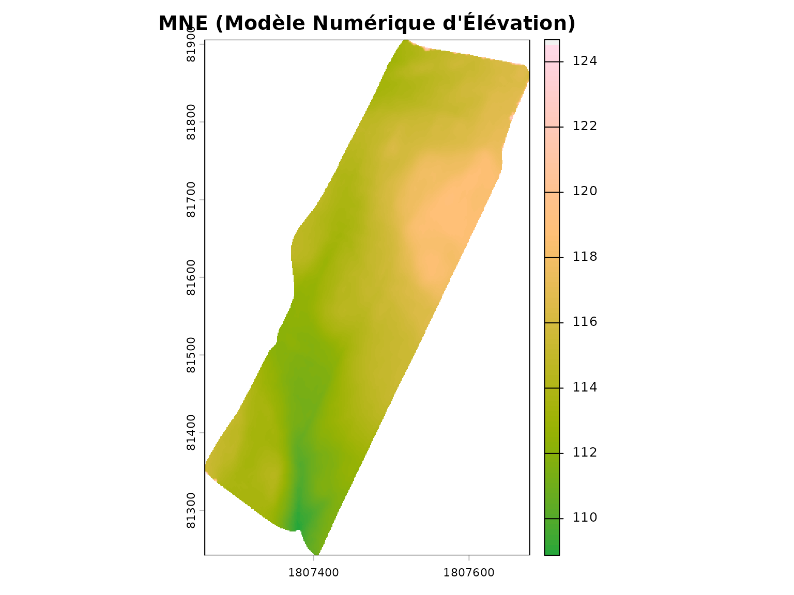
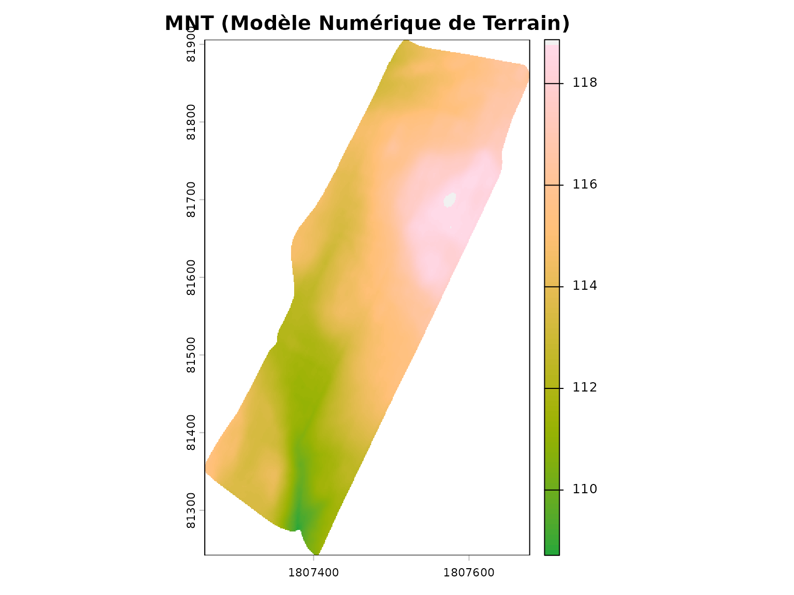
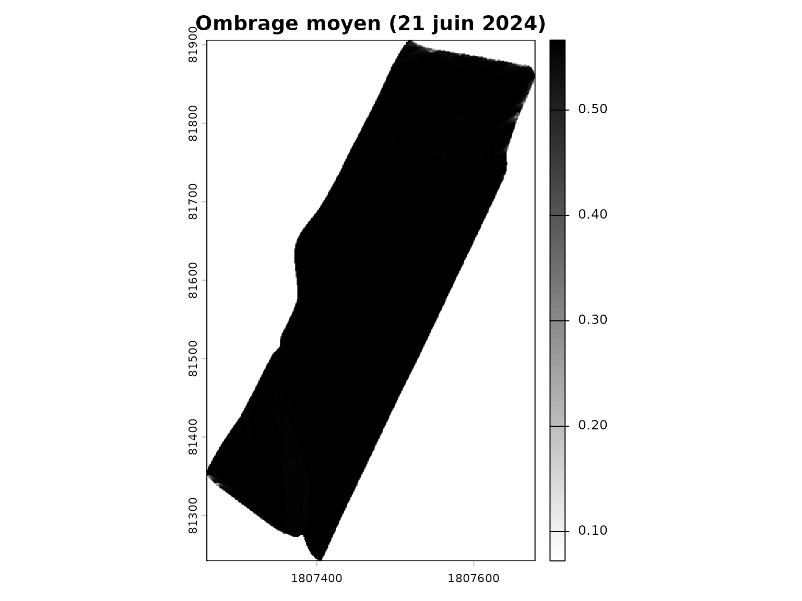
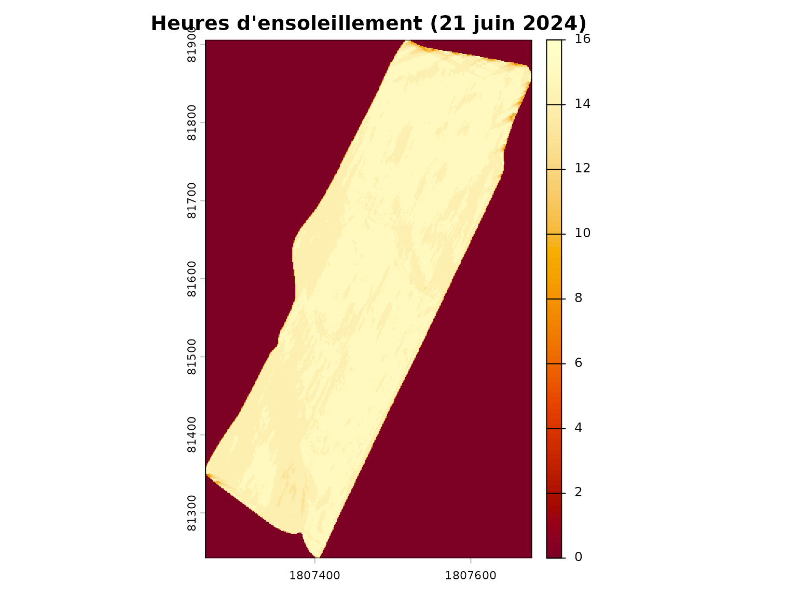
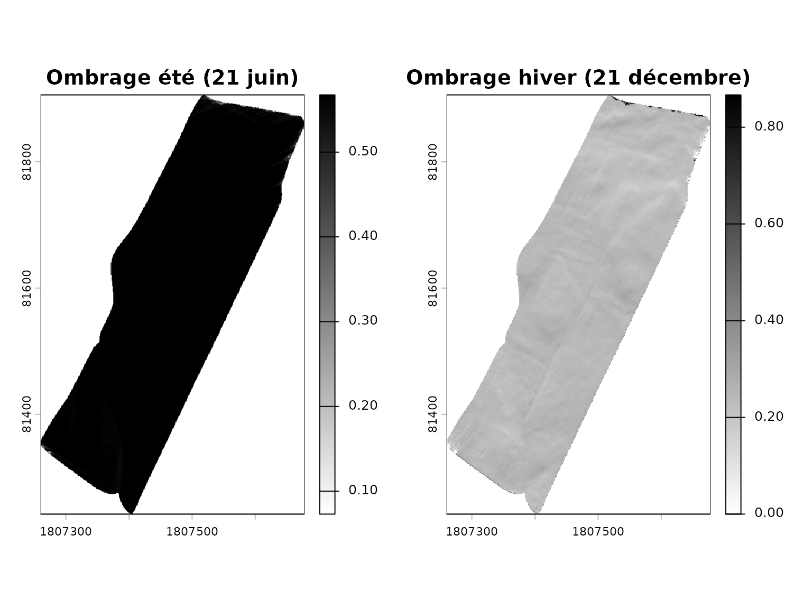
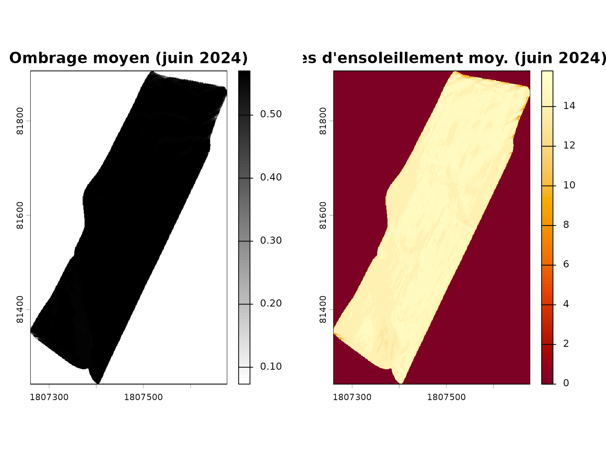

# Calcul de l'ombrage des parcelles

``` r
library(covariablechamps)
library(sf)
library(terra)
library(ggplot2)
```

## Introduction

L’ombrage projeté par les arbres et les haies sur les parcelles
agricoles peut avoir un impact significatif sur les cultures. Ce guide
présente les fonctions du package `covariablechamps` pour calculer et
visualiser l’ombrage à partir des données LiDAR et de la position du
soleil.

## Principes de base

Le calcul de l’ombrage repose sur:

1.  **Le Modèle Numérique d’Élévation (MNE)**: Inclut les arbres et
    structures
2.  **La position du soleil**: Azimut et élévation selon la date et
    l’heure
3.  **Le raycasting**: Projection des ombres selon l’angle du soleil

## Chargement du champ M2

Le package inclut un champ d’exemple (`M2`) situé au Québec.

``` r
champ <- st_read(system.file("extdata", "M2.shp", package = "covariablechamps"))
#> Reading layer `M2' from data source 
#>   `/home/runner/work/_temp/Library/covariablechamps/extdata/M2.shp' 
#>   using driver `ESRI Shapefile'
#> Simple feature collection with 1 feature and 65 fields
#> Geometry type: POLYGON
#> Dimension:     XY
#> Bounding box:  xmin: -71.06012 ymin: 46.64605 xmax: -71.05268 ymax: 46.65118
#> Geodetic CRS:  WGS 84
```

## Téléchargement du MNE (Modèle Numérique d’Élévation)

Le MNE inclut les arbres et permet de calculer les ombres projetées.

**Note**: Le téléchargement peut prendre quelques minutes.

``` r
# Télécharger le MNE (avec arbres)
mne <- telecharger_lidar(
  polygone = champ,
  mne = TRUE
)

plot(mne, main = "MNE (Modèle Numérique d'Élévation)",
     col = hcl.colors(100, "Terrain"))
plot(sf::st_geometry(champ), add = TRUE, border = "black", lwd = 2)
```



## Téléchargement du MNT (Modèle Numérique de Terrain)

Le MNT est le terrain sans les arbres (sol nu).

``` r
mnt <- telecharger_lidar(
  polygone = champ,
  mne = FALSE
)

plot(mnt, main = "MNT (Modèle Numérique de Terrain)",
     col = hcl.colors(100, "Terrain"))
plot(sf::st_geometry(champ), add = TRUE, border = "black", lwd = 2)
```



## Calcul de l’ombrage

Pour calculer l’ombrage à une date donnée:

``` r
ombrage <- calculer_ombrage(
  polygone = champ,
  date = "2024-06-21",
  intervalle_heures = 1
)

plot(ombrage$ombrage_moyen, main = "Ombrage moyen (21 juin 2024)",
     col = grey(100:0 / 100))
plot(sf::st_geometry(champ), add = TRUE, border = "black", lwd = 2)
```



### Paramètres importants

- `date`: Date au format “YYYY-MM-DD”
- `intervalle_heures`: Intervalle de temps entre les calculs
- `zscale`: Facteur d’échelle vertical (1 = mètres)

## Heures d’ensoleillement

Le nombre d’heures d’ensoleillement par pixel:

``` r
plot(ombrage$heures_ensoleillement, 
     main = "Heures d'ensoleillement (21 juin 2024)",
     col = hcl.colors(100, "YlOrRd"))
plot(sf::st_geometry(champ), add = TRUE, border = "black", lwd = 2)
```



## Comparaison été vs hiver

L’ombrage varie considérablement selon la saison:

``` r
# Été
ombrage_ete <- calculer_ombrage(
  polygone = champ,
  date = "2024-06-21",
  intervalle_heures = 2
)

# Hiver
ombrage_hiver <- calculer_ombrage(
  polygone = champ,
  date = "2024-12-21",
  intervalle_heures = 2
)

par(mfrow = c(1, 2), mar = c(3, 3, 3, 3))

plot(ombrage_ete$ombrage_moyen, main = "Ombrage été (21 juin)",
     col = grey(100:0 / 100))
plot(sf::st_geometry(champ), add = TRUE, border = "black", lwd = 2)

plot(ombrage_hiver$ombrage_moyen, main = "Ombrage hiver (21 décembre)",
     col = grey(100:0 / 100))
plot(sf::st_geometry(champ), add = TRUE, border = "black", lwd = 2)
```



## Calcul sur une période

La fonction
[`calculer_ombrage_periode()`](https://cedricbouffard.github.io/covariablechamps/reference/calculer_ombrage_periode.md)
calcule l’ombrage moyen sur une période:

``` r
resultat <- calculer_ombrage_periode(
  polygone = champ,
  date_debut = "2024-06-01",
  date_fin = "2024-06-30",
  intervalle_jours = 7
)

par(mfrow = c(1, 2), mar = c(3, 3, 3, 3))

plot(resultat$ombrage_moyen_periode, 
     main = "Ombrage moyen (juin 2024)",
     col = grey(100:0 / 100))
plot(sf::st_geometry(champ), add = TRUE, border = "black", lwd = 2)

plot(resultat$heures_ensoleillement_moyen,
     main = "Heures d'ensoleillement moy. (juin 2024)",
     col = hcl.colors(100, "YlOrRd"))
plot(sf::st_geometry(champ), add = TRUE, border = "black", lwd = 2)
```



## Applications

- **Cultures sensibles**: Identifier les zones à faible ensoleillement
- **Serres**: Planifier l’emplacement selon l’ombrage naturel
- **Arbres fruitiers**: Estimer l’ombre des haies sur les cultures
