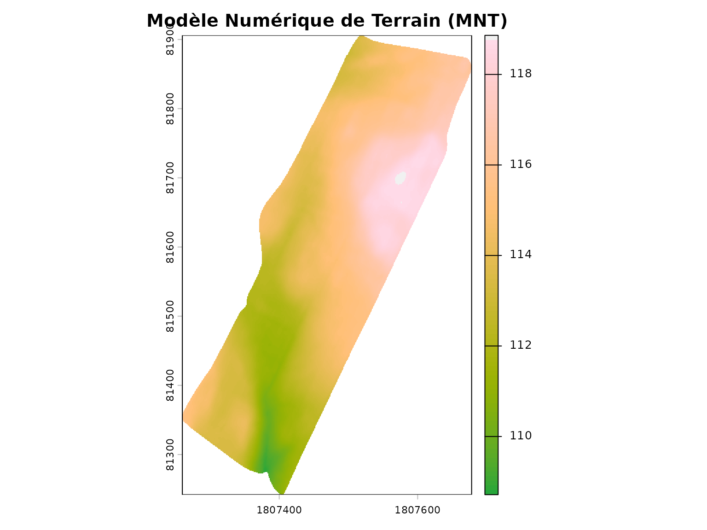
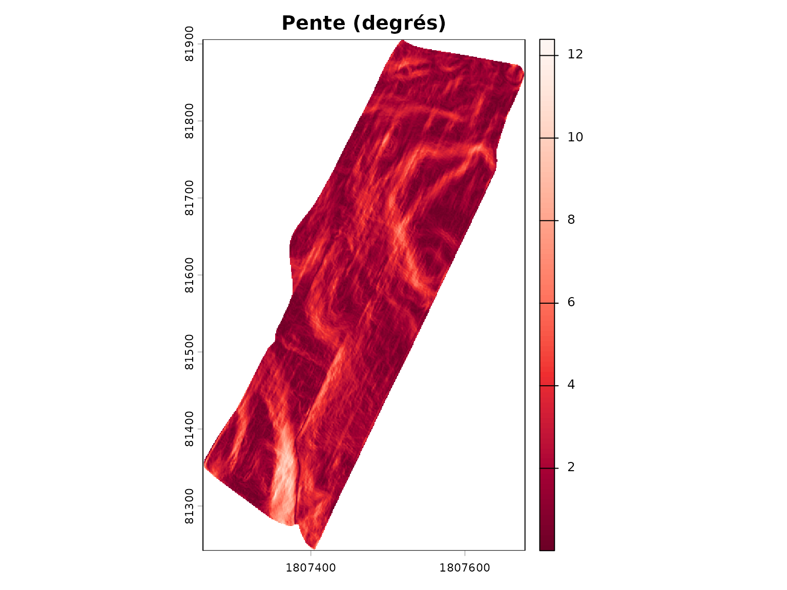
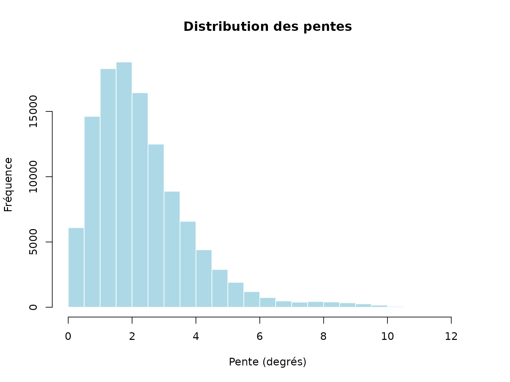
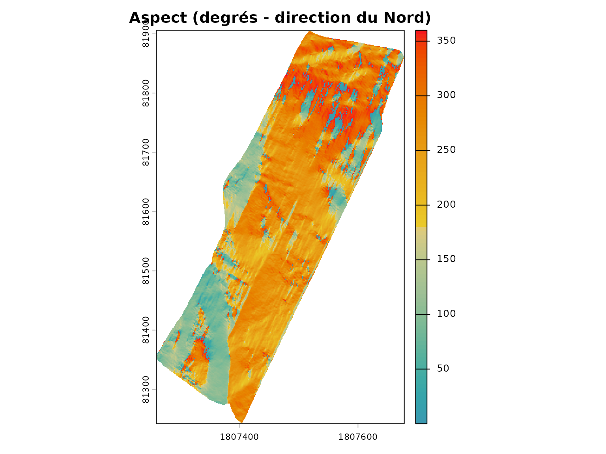
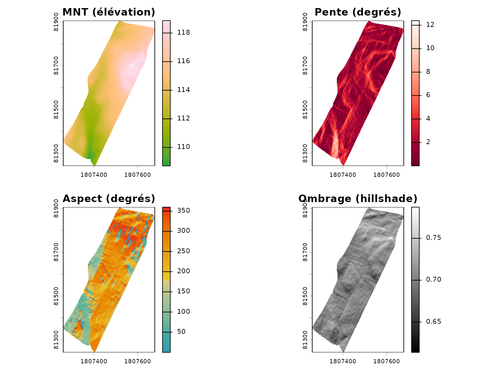
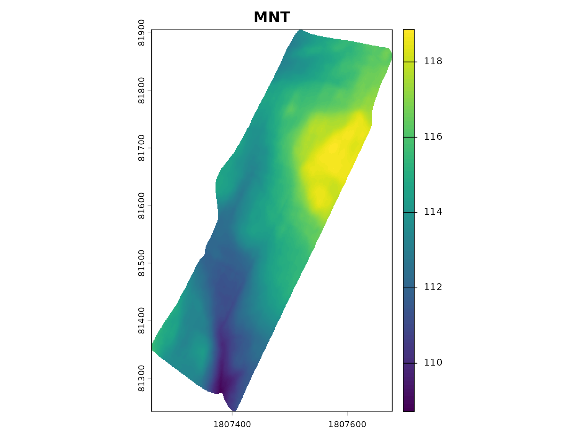
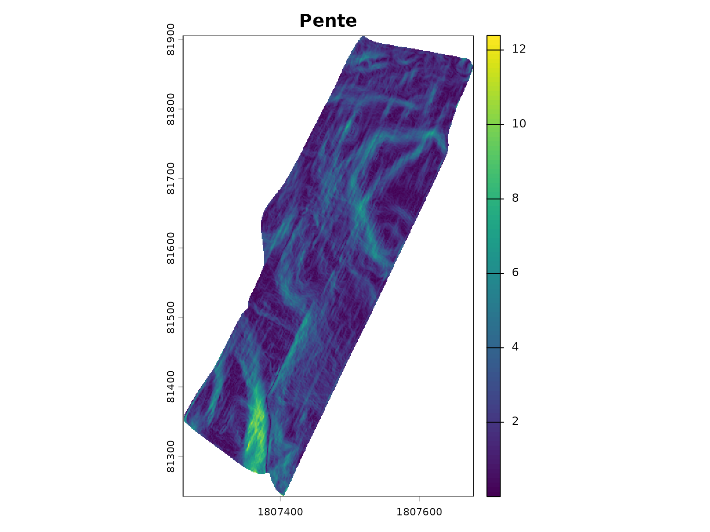
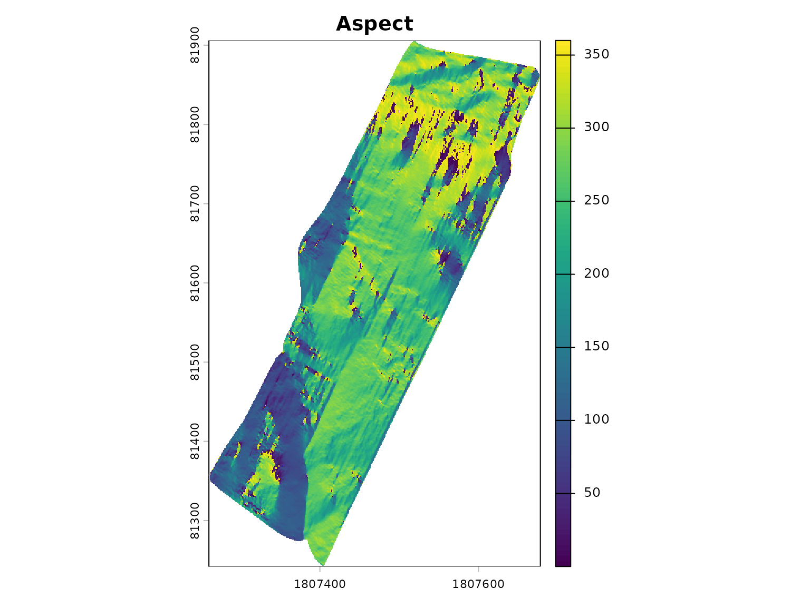

# Analyse Topographique des Champs Agricoles

``` r
library(covariablechamps)
library(sf)
library(terra)
library(ggplot2)
```

## Introduction

L’analyse topographique est essentielle pour comprendre le relief d’un
champ agricole. Le package `covariablechamps` fournit plusieurs outils
pour analyser la topographie:

- **Pente**: Inclinaison du terrain en degrés
- **Aspect**: Orientation du terrain (Nord, Sud, Est, Ouest)
- **Géomorphons**: Classification des formes de terrain

Ces covariables influencent: - Le drainage des sols - L’exposition au
soleil et au vent - La sensibilité à l’érosion - Le choix des cultures

## Chargement du champ M2

Le package inclut un champ d’exemple (`M2`) situé au Québec.

``` r
champ <- st_read(system.file("extdata", "M2.shp", package = "covariablechamps"))
#> Reading layer `M2' from data source 
#>   `/home/runner/work/_temp/Library/covariablechamps/extdata/M2.shp' 
#>   using driver `ESRI Shapefile'
#> Simple feature collection with 1 feature and 65 fields
#> Geometry type: POLYGON
#> Dimension:     XY
#> Bounding box:  xmin: -71.06012 ymin: 46.64605 xmax: -71.05268 ymax: 46.65118
#> Geodetic CRS:  WGS 84

ggplot() +
  geom_sf(data = champ, fill = "lightgreen", alpha = 0.5) +
  theme_minimal() +
  labs(title = "Champ M2",
       subtitle = "Champ d'exemple inclus dans le package")
```


## Téléchargement du MNT depuis LiDAR

Le MNT (Modèle Numérique de Terrain) est téléchargé depuis les données
LiDAR du DataCube du Canada.

**Note**: Le téléchargement peut prendre quelques minutes selon la
taille de la zone.

``` r
# Télécharger le MNT depuis LiDAR
mnt <- telecharger_lidar(
  polygone = champ,
  mne = FALSE  # FALSE = MNT (sans arbres)
)

plot(mnt, main = "Modèle Numérique de Terrain (MNT)",
     col = hcl.colors(100, "Terrain"))
plot(sf::st_geometry(champ), add = TRUE, border = "black", lwd = 2)
```



## Calcul de la pente

La fonction
[`calculer_pente()`](https://cedricbouffard.github.io/covariablechamps/reference/calculer_pente.md)
calcule l’inclinaison du terrain en degrés.

``` r
pente <- calculer_pente(mnt)

plot(pente, main = "Pente (degrés)",
     col = hcl.colors(100, "Reds"))
plot(sf::st_geometry(champ), add = TRUE, border = "black", lwd = 2)
```



### Distribution des pentes

``` r
vals_pente <- terra::values(pente)
vals_pente <- vals_pente[!is.na(vals_pente)]

hist(vals_pente, breaks = 30, main = "Distribution des pentes",
     xlab = "Pente (degrés)", ylab = "Fréquence",
     col = "lightblue", border = "white")
```



``` r

cat("Statistiques de la pente:\n")
#> Statistiques de la pente:
cat(sprintf("  Min: %.1f°\n", min(vals_pente)))
#>   Min: 0.0°
cat(sprintf("  Max: %.1f°\n", max(vals_pente)))
#>   Max: 12.4°
cat(sprintf("  Moyenne: %.1f°\n", mean(vals_pente)))
#>   Moyenne: 2.3°
cat(sprintf("  Médiane: %.1f°\n", median(vals_pente)))
#>   Médiane: 2.0°
```

## Calcul de l’aspect (orientation)

La fonction
[`calculer_aspect()`](https://cedricbouffard.github.io/covariablechamps/reference/calculer_aspect.md)
calcule l’orientation du terrain.

``` r
aspect <- calculer_aspect(mnt)

plot(aspect, main = "Aspect (degrés - direction du Nord)",
     col = hcl.colors(100, "Zissou"))
plot(sf::st_geometry(champ), add = TRUE, border = "black", lwd = 2)
```



### Interprétation de l’aspect

L’aspect est exprimé en degrés: - 0° ou 360° = Nord - 90° = Est - 180° =
Sud - 270° = Ouest

Les valeurs manquantes (NA) indiquent les zones plates.

## Visualisation combinée

``` r
par(mfrow = c(2, 2), mar = c(3, 3, 3, 3))

plot(mnt, main = "MNT (élévation)", col = hcl.colors(100, "Terrain"))
plot(sf::st_geometry(champ), add = TRUE, border = "black", lwd = 2)

plot(pente, main = "Pente (degrés)", col = hcl.colors(100, "Reds"))
plot(sf::st_geometry(champ), add = TRUE, border = "black", lwd = 2)

plot(aspect, main = "Aspect (degrés)", col = hcl.colors(100, "Zissou"))
plot(sf::st_geometry(champ), add = TRUE, border = "black", lwd = 2)

# Ombrage (hillshade)
hillshade <- terra::shade(slope = pente * pi / 180, 
                          aspect = aspect * pi / 180)
plot(hillshade, main = "Ombrage (hillshade)", col = grey(0:100 / 100))
plot(sf::st_geometry(champ), add = TRUE, border = "black", lwd = 2)
```



## Extraction complète des covariables terrain

La fonction
[`extraire_covariables_terrain()`](https://cedricbouffard.github.io/covariablechamps/reference/extraire_covariables_terrain.md)
calcule toutes les covariables en une seule commande:

``` r
result <- extraire_covariables_terrain(
  polygone = champ,
  dossier = NULL  # Sans sauvegarder
)

plot(result$mnt, main = "MNT")
```



``` r
plot(result$pente, main = "Pente")
```



``` r
plot(result$aspect, main = "Aspect")
```



## Applications agricoles

### Drainage et pente

Les zones à forte pente sont généralement: - Mieux drainées (moins de
saturation) - Plus sensibles à l’érosion - Plus difficiles à cultiver

### Exposition et aspect

L’orientation du terrain affecte: - L’ensoleillement (sud = plus
chaud) - L’exposition aux vents dominants - Le gel tardif au printemps

### Planification

Combinez la topographie avec d’autres données pour: - Identifier les
zones à risque d’érosion - Optimiser le drainage - Planifier les
rotations de cultures
