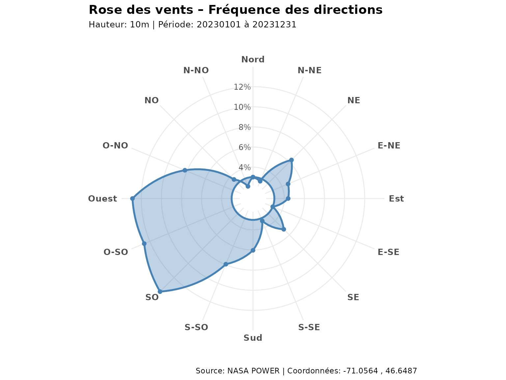
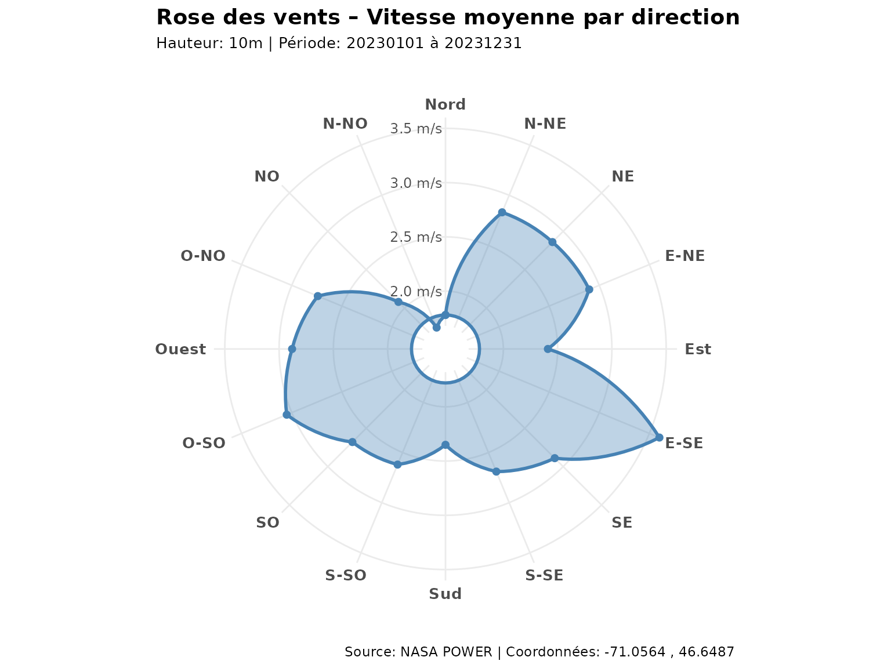
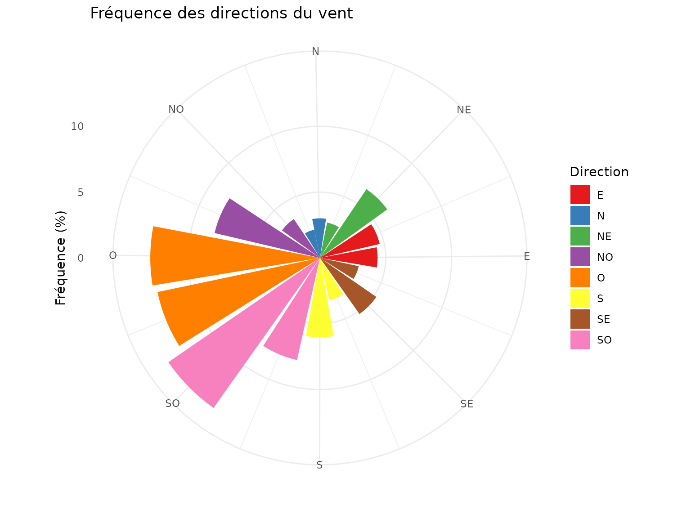
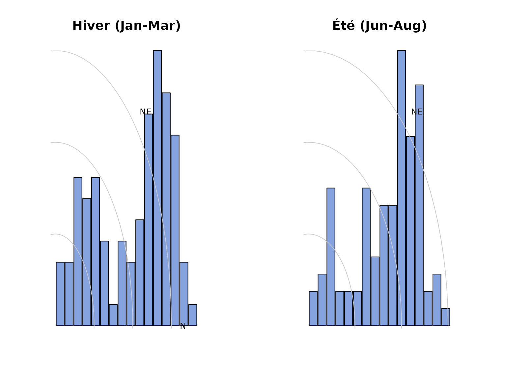

# Analyse du Vent et Données Météorologiques

``` r
library(covariablechamps)
library(sf)
library(terra)
library(ggplot2)
library(dplyr)
```

## Introduction

L’analyse du vent est cruciale pour: - Planifier l’implantation de haies
brise-vent - Estimer l’ombrage des cultures - Optimiser le drainage et
la circulation de l’air - Prévoir les risques de renversement des
cultures

Le package `covariablechamps` fournit des outils pour obtenir et
visualiser les données de vent depuis **NASA POWER**.

## Chargement du champ M2

Le package inclut un champ d’exemple (`M2`) situé au Québec.

``` r
champ <- st_read(system.file("extdata", "M2.shp", package = "covariablechamps"))
#> Reading layer `M2' from data source 
#>   `/home/runner/work/_temp/Library/covariablechamps/extdata/M2.shp' 
#>   using driver `ESRI Shapefile'
#> Simple feature collection with 1 feature and 65 fields
#> Geometry type: POLYGON
#> Dimension:     XY
#> Bounding box:  xmin: -71.06012 ymin: 46.64605 xmax: -71.05268 ymax: 46.65118
#> Geodetic CRS:  WGS 84

ggplot() +
  geom_sf(data = champ, fill = "lightgreen", alpha = 0.5) +
  theme_minimal() +
  labs(title = "Champ M2",
       subtitle = "Champ d'exemple inclus dans le package")
```


## Obtention des données de vent depuis NASA POWER

La fonction
[`obtenir_rose_vents()`](https://cedricbouffard.github.io/covariablechamps/reference/obtenir_rose_vents.md)
récupère les données de rose des vents depuis l’API NASA POWER.

**Note**: Nécessite une connexion internet.

``` r
rose <- obtenir_rose_vents(
  polygone = champ,
  date_debut = "20230101",
  date_fin = "20231231",
  hauteur = "10m"
)

cat("Données obtenues pour:", rose$coordonnees[1], ",", rose$coordonnees[2], "\n")
#> Données obtenues pour: -71.05644 , 46.64874
cat("Directions analysées:", length(rose$directions), "\n")
#> Directions analysées: 16
```

## Visualisation: Rose des vents

### Rose des vents (fréquence)

``` r
tracer_rose_vents(rose, type = "pct")
```



### Rose des vents (vitesse moyenne)

``` r
tracer_rose_vents(rose, type = "avg")
```



## Direction dominante

``` r
direction_dom <- rose$directions[which.max(rose$wd_pct)]
freq_max <- max(rose$wd_pct, na.rm = TRUE)

cat(sprintf("Direction dominante: %.0f° (%.1f%% des vents)\n", 
            direction_dom, freq_max))
#> Direction dominante: 225° (14.0% des vents)

cat("\nOrientation:\n")
#> 
#> Orientation:
cat("  0°   = Nord\n")
#>   0°   = Nord
cat("  90°  = Est\n")
#>   90°  = Est
cat("  180° = Sud\n")
#>   180° = Sud
cat("  270° = Ouest\n")
#>   270° = Ouest
```

## Distribution des directions

``` r
df_rose <- data.frame(
  direction = rose$directions,
  frequence = rose$wd_pct
) |>
  mutate(
    direction_cardinale = case_when(
      direction >= 337.5 | direction < 22.5 ~ "N",
      direction >= 22.5 & direction < 67.5 ~ "NE",
      direction >= 67.5 & direction < 112.5 ~ "E",
      direction >= 112.5 & direction < 157.5 ~ "SE",
      direction >= 157.5 & direction < 202.5 ~ "S",
      direction >= 202.5 & direction < 247.5 ~ "SO",
      direction >= 247.5 & direction < 292.5 ~ "O",
      direction >= 292.5 & direction < 337.5 ~ "NO"
    )
  )

ggplot(df_rose, aes(x = direction, y = frequence, fill = direction_cardinale)) +
  geom_col(width = 20) +
  scale_fill_brewer(palette = "Set1") +
  coord_polar(theta = "x", start = -11.25 * pi / 180) +
  scale_x_continuous(breaks = seq(0, 337.5, by = 45),
                     labels = c("N", "NE", "E", "SE", "S", "SO", "O", "NO")) +
  theme_minimal() +
  labs(title = "Fréquence des directions du vent",
       x = "", y = "Fréquence (%)", fill = "Direction")
```



## Comparaison saisonnière

``` r
# Hiver (décembre-février)
rose_hiver <- obtenir_rose_vents(
  polygone = champ,
  date_debut = "20230101",
  date_fin = "20230331",
  hauteur = "10m"
)

# Été (juin-août)
rose_ete <- obtenir_rose_vents(
  polygone = champ,
  date_debut = "20230601",
  date_fin = "20230831",
  hauteur = "10m"
)

par(mfrow = c(1, 2), mar = c(4, 4, 4, 4))

# Fonction pour tracer une rose simple
plot_rose_simple <- function(rose_data, main) {
  freqs <- rose_data$wd_pct
  angles <- (rose_data$directions - 90) * pi / 180
  freqs[is.na(freqs)] <- 0
  
  barplot(freqs, axes = FALSE, axisnames = FALSE,
          width = rep(1, length(freqs)), space = 0.1,
          col = rgb(0.2, 0.4, 0.8, 0.6),
          main = main)
  
  r_max <- max(freqs, na.rm = TRUE)
  for (i in seq(0, r_max, length.out = 4)) {
    angle_seq <- seq(0, 2 * pi, length.out = 100)
    lines(i * cos(angle_seq), i * sin(angle_seq), col = "grey80")
  }
  
  dir_labels <- c("N", "NE", "E", "SE", "S", "SO", "O", "NO")
  angles_labels <- seq(0, 7) * pi / 4
  text(r_max * 1.1 * cos(angles_labels), 
       r_max * 1.1 * sin(angles_labels), 
       dir_labels, cex = 0.8)
}

plot_rose_simple(rose_hiver, "Hiver (Jan-Mar)")
plot_rose_simple(rose_ete, "Été (Jun-Aug)")
```



## Applications agricoles

### Haies brise-vent

- Planifier l’orientation des haies perpendiculairement au vent dominant
- Estimer la zone de protection (1-10H où H = hauteur de la haie)

### Érosion

- Identifier les zones vulnérables au vent
- Prévoir les dépôts de sable

## Références

- [NASA POWER](https://power.larc.nasa.gov/) - Données météorologiques
  mondiales
